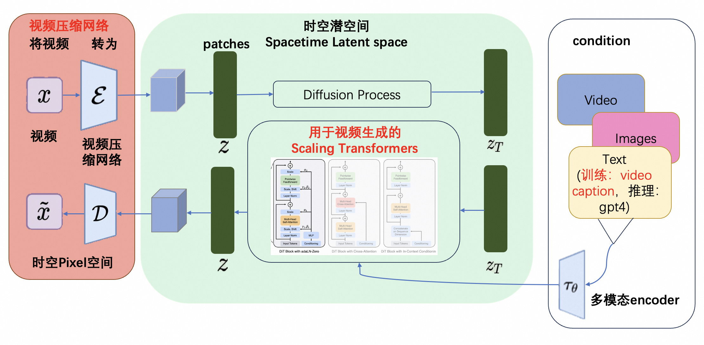
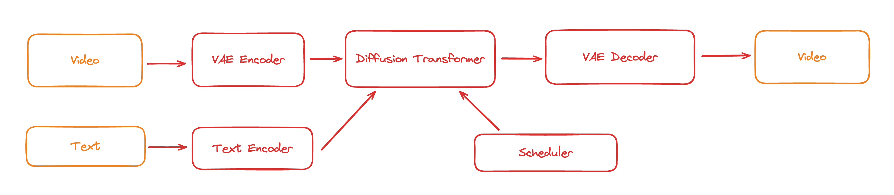
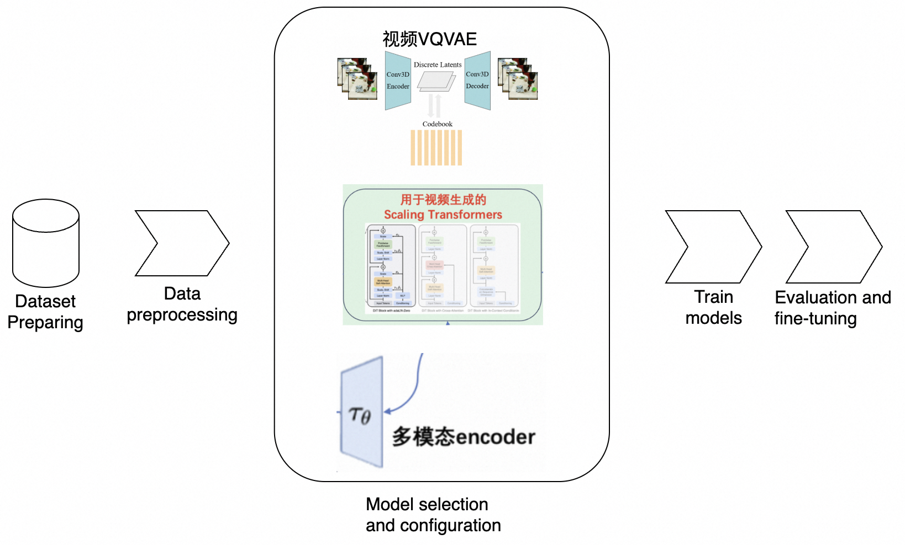
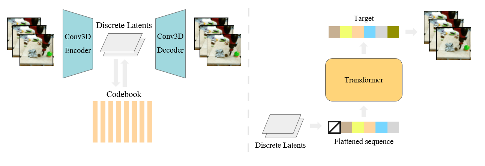

# 3.训练Sore准备工作

## 1.训练Sora模型

在Sora的技术报告中，Sora使用视频压缩网络将各种大小的视频压缩为潜在空间中的时空patches sequence，然后使用Diffusion Transformer进行去噪，最后解码生成视频。

Open-Sora 在下图中总结了 Sora 可能使用的训练流程。

训练链路

## 2.数据准备

#### **VideoInstruct-100K**

VideoInstruct100K 是使用人工辅助和半自动注释技术生成的高质量视频对话数据集。数据集中的问题答案与以下内容相关：

-   视频摘要
-   基于描述的问题答案（探索空间、时间、关系和推理概念）
-   创意/生成性问题解答

链接：[https://modelscope.cn/datasets/AI-ModelScope/VideoInstruct-100K](https://modelscope.cn/datasets/AI-ModelScope/VideoInstruct-100K/summary "https://modelscope.cn/datasets/AI-ModelScope/VideoInstruct-100K")

#### **panda-70m**

Panda-70M 是一个包含 70M 高质量视频字幕对的大规模数据集。该存储库分为三个部分：

-   数据集数据加载包括列出 Panda-70M 数据的 csv 文件以及下载数据集的代码。
-   分割包括将长视频分割成多个语义一致的短片的代码。
-   字幕包括在 Panda-70M 上训练的拟议视频字幕模型。

**链接：**[https://modelscope.cn/datasets/AI-ModelScope/panda-70m](https://modelscope.cn/datasets/AI-ModelScope/panda-70m/summary "https://modelscope.cn/datasets/AI-ModelScope/panda-70m")

#### **Youku-mPLUG**

Youku-mPLUG预训练数据集挖掘自优酷站内海量的优质短视频内容

-   包含千万级别约36TB的视频、文本数据。
-   其中视频均为覆盖10～120秒的UGC短视频内容，文本为视频对应的描述标题，长度5～30不等。
-   该数据集抽取时品类均衡，内容共包含45个大类。

链接：[https://modelscope.cn/datasets/modelscope/Youku-AliceMind](https://modelscope.cn/datasets/modelscope/Youku-AliceMind/summary "https://modelscope.cn/datasets/modelscope/Youku-AliceMind")

#### **MSR-VTT**

MSR-VTT（Microsoft Research Video to Text）是一个开放域视频字幕的大规模数据集。

-   由 20 个类别的 10,000 个视频片段组成，每个视频片段由 Amazon Mechanical Turks 标注了 20 个英文句子。
-   所有标题中约有 29,000 个独特单词。 
-   标准分割使用 6,513 个split用于训练，497 个split用于验证，2,990 个split用于测试。

链接：[https://modelscope.cn/datasets/AI-ModelScope/msr-vtt](https://modelscope.cn/datasets/AI-ModelScope/msr-vtt/summary "https://modelscope.cn/datasets/AI-ModelScope/msr-vtt")

#### **Shot2Story**

视频文本基准和用于多镜头视频理解的可扩展代码。包含20k 视频的详细长摘要和 80k 视频镜头的镜头字幕。

链接：[https://modelscope.cn/datasets/AI-ModelScope/Shot2Story](https://modelscope.cn/datasets/AI-ModelScope/Shot2Story/summary "https://modelscope.cn/datasets/AI-ModelScope/Shot2Story")

#### **InternVid**

InternVid 是一个以视频为中心的大规模多模态数据集，可以学习强大且可转移的视频文本表示，以实现多模态理解和生成。 InternVid 数据集包含超过 700 万个视频，持续近 76 万小时，产生 2.34 亿个视频剪辑，并附有总共 4.1B 个单词的详细描述。

链接：[https://modelscope.cn/datasets/AI-ModelScope/InternVid](https://modelscope.cn/datasets/AI-ModelScope/InternVid/summary "https://modelscope.cn/datasets/AI-ModelScope/InternVid")

#### **webvid-10M**

大型文本视频数据集，包含从素材网站抓取的**1000 万个视频文本对。**

链接：[https://modelscope.cn/datasets/AI-ModelScope/webvid-10M](https://modelscope.cn/datasets/AI-ModelScope/webvid-10M/summary "https://modelscope.cn/datasets/AI-ModelScope/webvid-10M")

## 3.数据预处理

目前主流LLM框架缺乏针对 video数据 统一便捷的管理和处理能力，且多模态数据处理标准方案缺失

-   Huggingface-Datasets 官方认为video比image更棘手，[暂未支持](https://discuss.huggingface.co/t/hf-dataset-for-videos/45900 "暂未支持")
-   相关video库对该场景过于庞杂或简单
-   [FFmpeg](https://github.com/FFmpeg/FFmpeg "FFmpeg")：150w行+源码，大量底层细节
    -   pytorchvideo：主要支持[加载](https://pytorchvideo.readthedocs.io/en/latest/api/data/data.html "加载")和少量单video模态的[tensor transform](https://pytorchvideo.readthedocs.io/en/latest/api/transforms/transforms.html#module-pytorchvideo.transforms.functional "tensor transform")（翻转、扰动、采样等）
-   SORA官方仅模糊提及使用了DALLE3来生成caption，细粒度的"caption --> spacetime patch"建模比较关键
-   从SORA模型效果看，数据需要有变化的时长、分辨率和宽高比

[Data-Juicer](https://github.com/alibaba/data-juicer/docs/DJ_SORA_ZH.md "Data-Juicer") 扩展了对多模态数据的支持，已实现上百个专用的视频、图像、音频、文本等多模态数据处理算子及工具，帮助用户分析、清洗及生成大规模高质量数据。

## 4.模型选型和训练

### 4.1 视频VQVAE

VideoGPT 使用 **VQ-VAE**，通**过采用 3D 卷积和轴向自注意力来学习原始视频的下采样离散潜在表示**。然后使用一个简单的类似 GPT 的架构，使用时空位置编码对离散潜在变量进行自回归建模。用于 BAIR Robot 数据集上的视频生成，并从 UCF-101 和 Tumbler GIF 生成高保真自然图像数据集（TGIF）。

[https://github.com/wilson1yan/VideoGPT/](https://github.com/wilson1yan/VideoGPT/ "https://github.com/wilson1yan/VideoGPT/")

### 4.2 Diffusion Transformer

普遍认为Diffusion Transformer模型是Sora的技术基础，通过结合diffusion model和transformer，从而达到可以scale up model来提升图像生成质量的效果。我们总结了三个目前开源的Diffusion Transformer研究如下，并总结了最佳实践，可以在魔搭社区的免费算力上运行和测试。

#### （1）UViT

**UViT：** All are Worth Words: A ViT Backbone for Diffusion Models

-   论文链接：[https://arxiv.org/abs/2209.12152](https://arxiv.org/abs/2209.12152 "https://arxiv.org/abs/2209.12152")
-   代码库链接：[https://github.com/baofff/U-ViT](https://github.com/baofff/U-ViT "https://github.com/baofff/U-ViT")
-   模型链接：[https://modelscope.cn/models/thu-ml/imagenet256\_uvit\_huge](https://modelscope.cn/models/thu-ml/imagenet256_uvit_huge/summary "https://modelscope.cn/models/thu-ml/imagenet256_uvit_huge")
-   最佳实践：[https://github.com/modelscope/modelscope/blob/master/examples/pytorch/UViT\_ImageNet\_demo.ipynb](https://github.com/modelscope/modelscope/blob/master/examples/pytorch/UViT_ImageNet_demo.ipynb "https://github.com/modelscope/modelscope/blob/master/examples/pytorch/UViT_ImageNet_demo.ipynb")

**U-ViT**是一种简单且通用的基于ViT的扩散概率模型的主干网络，U-ViT把所有输入，包括图片、时间、条件都当作token输入，并且引入了**long skip connection**。U-ViT在无条件生成、类别条件生成以及文到图生成上均取得了可比或者优于CNN的结果。为未来扩散模型中骨干网络研究提供见解，并有利于大规模跨模态数据集的生成建模。

#### （2）DiT

**DiT**同样的提出了使用ViT代替U-Net的思想，不同的是**DiT中没有引入long skip connection也依然取得了杰出的效果**。推测原因可能有：

-   DiT 出色的**Adaptive layer norm**以及**零初始化的设计**能够有效提升生成质量；
-   DiT 在建模特征空间表现良好，但在建模像素空间表现欠缺，可能在用扩散概率模型建模像素空间分布时long skip connection是至关重要的；
-   即使在建模特征空间上，DiT 没有long skip connection也能取得很好的效果，但long skip connection在加速收敛方面也起着关键的作用。

而近期推出的可扩展插值变压器 **(SiT)**，是建立在DiT 基础上的生成模型系列。 **插值框架，** 相比标准的diffusion模型允许以更灵活的方式连接两个distributions，使得对影响生成的各种设计选择的模块化研究成为可能。SiT 在 ImageNet 256x256 基准上模型大小和效果超过了 DiT和UViT，SiT 实现了**2.06 的 FID-50K 分数。**

### 4.3 Video-caption

OpenAI训练了一个具备高度描述性的视频标题生成（Video Captioning）模型，使用这个模型为所有的视频训练数据生成了高质量文本标题，再将视频和高质量标题作为视频文本对进行训练。通过这样的高质量的训练数据，保障了文本（prompt）和视频数据之间高度的align。通过近期的讨论和资料，我们推测Video Captioning模型是由多模态大语言模型VLM（如**GPT4V模型）** 微调出来的。开发者也可以通过视频抽帧+开源VLM生成描述+LLM总结描述的方式，生成较好的视频描述。

一些开源多模态模型：

#### （1）零一万物VL模型（Yi-VL-34B）

-   代码库链接：[https://github.com/01-ai/Yi/tree/main/VL](https://github.com/01-ai/Yi/tree/main/VL "https://github.com/01-ai/Yi/tree/main/VL")
-   模型链接：[https://modelscope.cn/models/01ai/Yi-VL-34B/](https://modelscope.cn/models/01ai/Yi-VL-34B/summary "https://modelscope.cn/models/01ai/Yi-VL-34B/")
-   最佳实践：[https://mp.weixin.qq.com/s?\_\_biz=MzkxNTM5NTg2OA==\&mid=2247488964\&idx=1\&sn=b40140340c9ce817f8181e94a221dbc8\&chksm=c15e91b7f62918a178419556b3099ee4cff617936a7197b97c9409978613cb4cabfe9b70d609\&token=740682062\&lang=zh\_CN#rd](https://mp.weixin.qq.com/s?__biz=MzkxNTM5NTg2OA==\&mid=2247488964\&idx=1\&sn=b40140340c9ce817f8181e94a221dbc8\&chksm=c15e91b7f62918a178419556b3099ee4cff617936a7197b97c9409978613cb4cabfe9b70d609\&token=740682062\&lang=zh_CN#rd "https://mp.weixin.qq.com/s?__biz=MzkxNTM5NTg2OA==\&mid=2247488964\&idx=1\&sn=b40140340c9ce817f8181e94a221dbc8\&chksm=c15e91b7f62918a178419556b3099ee4cff617936a7197b97c9409978613cb4cabfe9b70d609\&token=740682062\&lang=zh_CN#rd")

#### （2）**通义千问VL模型（Qwen-VL-Chat）**

-   论文链接：[https://arxiv.org/abs/2308.12966](https://arxiv.org/abs/2308.12966 "https://arxiv.org/abs/2308.12966")
-   代码库链接：[https://github.com/QwenLM/Qwen-VL](https://github.com/QwenLM/Qwen-VL "https://github.com/QwenLM/Qwen-VL")
-   模型链接：[https://modelscope.cn/models/qwen/Qwen-VL-Chat](https://modelscope.cn/models/qwen/Qwen-VL-Chat/summary "https://modelscope.cn/models/qwen/Qwen-VL-Chat")
-   最佳实践：[https://mp.weixin.qq.com/s?\_\_biz=MzkxNTM5NTg2OA==\&mid=2247486027\&idx=1\&sn=4fd6c93edd5a97ec017d692b4bc81506\&chksm=c15e8e38f629072e0df1eb4d00b2d71281f1fd77b2c138ba95a007643d0697b6a8f7eb697ddd\&token=740682062\&lang=zh\_CN#rd](https://mp.weixin.qq.com/s?__biz=MzkxNTM5NTg2OA==\&mid=2247486027\&idx=1\&sn=4fd6c93edd5a97ec017d692b4bc81506\&chksm=c15e8e38f629072e0df1eb4d00b2d71281f1fd77b2c138ba95a007643d0697b6a8f7eb697ddd\&token=740682062\&lang=zh_CN#rd "https://mp.weixin.qq.com/s?__biz=MzkxNTM5NTg2OA==\&mid=2247486027\&idx=1\&sn=4fd6c93edd5a97ec017d692b4bc81506\&chksm=c15e8e38f629072e0df1eb4d00b2d71281f1fd77b2c138ba95a007643d0697b6a8f7eb697ddd\&token=740682062\&lang=zh_CN#rd")

#### （3）**浦语·灵笔2-视觉问答-7B（internlm-xcomposer2-vl-7b）**

-   **代码库链接：**[https://github.com/InternLM/InternLM-XComposer](https://github.com/InternLM/InternLM-XComposer "https://github.com/InternLM/InternLM-XComposer")
-   **模型链接：**[https://modelscope.cn/models/Shanghai\_AI\_Laboratory/internlm-xcomposer2-vl-7b/summary](https://modelscope.cn/models/Shanghai_AI_Laboratory/internlm-xcomposer2-vl-7b/summary "https://modelscope.cn/models/Shanghai_AI_Laboratory/internlm-xcomposer2-vl-7b/summary")
-   [https://modelscope.cn/models/Shanghai\_AI\_Laboratory/internlm-xcomposer2-vl-7b/summary](https://modelscope.cn/models/Shanghai_AI_Laboratory/internlm-xcomposer2-vl-7b/summary "https://modelscope.cn/models/Shanghai_AI_Laboratory/internlm-xcomposer2-vl-7b/summary")
-   最佳实践：[https://mp.weixin.qq.com/s?\_\_biz=MzkxNTM5NTg2OA==\&mid=2247489025\&idx=1\&sn=7b0b3d8d6cf32a7c59d6e5421e9d874d\&chksm=c15e9272f6291b6441147249afb34b52e86b05b3762c1bf677f2c98ab7cf98ca01fd3291ac68\&token=740682062\&lang=zh\_CN#rd](https://mp.weixin.qq.com/s?__biz=MzkxNTM5NTg2OA==\&mid=2247489025\&idx=1\&sn=7b0b3d8d6cf32a7c59d6e5421e9d874d\&chksm=c15e9272f6291b6441147249afb34b52e86b05b3762c1bf677f2c98ab7cf98ca01fd3291ac68\&token=740682062\&lang=zh_CN#rd "https://mp.weixin.qq.com/s?__biz=MzkxNTM5NTg2OA==\&mid=2247489025\&idx=1\&sn=7b0b3d8d6cf32a7c59d6e5421e9d874d\&chksm=c15e9272f6291b6441147249afb34b52e86b05b3762c1bf677f2c98ab7cf98ca01fd3291ac68\&token=740682062\&lang=zh_CN#rd")

#### （4）**CogVLM模型**

-   技术报告：[https://zhipu-ai.feishu.cn/wiki/LXQIwqo1OiIVTykMh9Lc3w1Fn7g](https://zhipu-ai.feishu.cn/wiki/LXQIwqo1OiIVTykMh9Lc3w1Fn7g "https://zhipu-ai.feishu.cn/wiki/LXQIwqo1OiIVTykMh9Lc3w1Fn7g")
-   代码库链接：[https://github.com/THUDM/CogVLM](https://github.com/THUDM/CogVLM "https://github.com/THUDM/CogVLM")
-   模型链接：[https://modelscope.cn/models/ZhipuAI/CogVLM/summary](https://modelscope.cn/models/ZhipuAI/CogVLM/summary "https://modelscope.cn/models/ZhipuAI/CogVLM/summary")
-   最佳实践：[https://mp.weixin.qq.com/s?\_\_biz=MzkxNTM5NTg2OA==\&mid=2247486833\&idx=1\&sn=13dda47e2feca1147f7c763b7cde91dd\&chksm=c15e8902f62900143a04fd2a4591887c3c4841f33c28dfa75b6da1c5d8c914edd33d767829b7\&token=740682062\&lang=zh\_CN#rd](https://mp.weixin.qq.com/s?__biz=MzkxNTM5NTg2OA==\&mid=2247486833\&idx=1\&sn=13dda47e2feca1147f7c763b7cde91dd\&chksm=c15e8902f62900143a04fd2a4591887c3c4841f33c28dfa75b6da1c5d8c914edd33d767829b7\&token=740682062\&lang=zh_CN#rd "https://mp.weixin.qq.com/s?__biz=MzkxNTM5NTg2OA==\&mid=2247486833\&idx=1\&sn=13dda47e2feca1147f7c763b7cde91dd\&chksm=c15e8902f62900143a04fd2a4591887c3c4841f33c28dfa75b6da1c5d8c914edd33d767829b7\&token=740682062\&lang=zh_CN#rd")

#### （5）**MiniCPM-V模型**

-   **论文链接：**[https://arxiv.org/abs/2308.12038](https://arxiv.org/abs/2308.12038 "https://arxiv.org/abs/2308.12038")
-   **代码库链接：**[https://github.com/OpenBMB/OmniLMM/](https://github.com/OpenBMB/OmniLMM/ "https://github.com/OpenBMB/OmniLMM/")
-   模型链接：[https://modelscope.cn/models/OpenBMB/MiniCPM-V/summary](https://modelscope.cn/models/OpenBMB/MiniCPM-V/summary "https://modelscope.cn/models/OpenBMB/MiniCPM-V/summary")

#### （6）**Video-LLaVA模型**

-   论文链接：[https://arxiv.org/abs/2311.10122](https://arxiv.org/abs/2311.10122 "https://arxiv.org/abs/2311.10122")
-   代码库链接：[https://github.com/PKU-YuanGroup/Video-LLaVA](https://github.com/PKU-YuanGroup/Video-LLaVA "https://github.com/PKU-YuanGroup/Video-LLaVA")
-   模型链接：[https://modelscope.cn/models/PKU-YuanLab/Video-LLaVA-7B/summary](https://modelscope.cn/models/PKU-YuanLab/Video-LLaVA-7B/summary "https://modelscope.cn/models/PKU-YuanLab/Video-LLaVA-7B/summary")

**总结对比：**

从模型参数量来看，零一万物，CogVLM的模型是百亿参数，但是仅支持英文，通义，灵笔等模型可以较好的支持中文，Video-LLaVA可以支持直接对视频的理解，可以根据需求来选择具体的多模态大语言模型。
