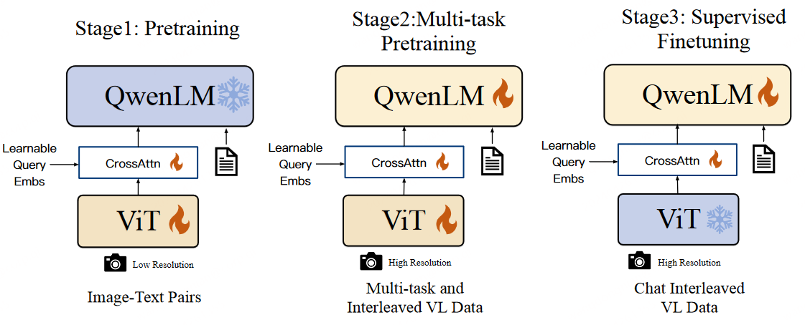
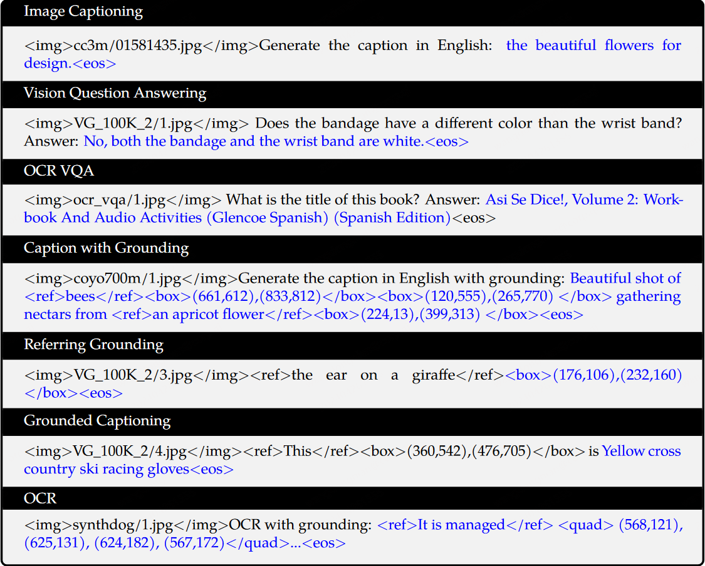
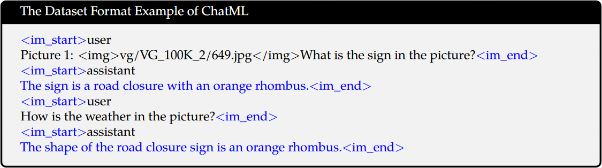

# qwen vl

论文链接：[Qwen-VL: A Versatile Vision-Language Model for Understanding, Localization, Text Reading, and Beyond (arxiv.org)](https://arxiv.org/abs/2308.12966 "Qwen-VL: A Versatile Vision-Language Model for Understanding, Localization, Text Reading, and Beyond (arxiv.org)")

## 0.摘要

- Qwen-VL系列模型在多种视觉中心任务上设立了新的记录，包括图像描述、问答、视觉定位等。
- 该模型支持多语言对话、多图像输入、文本阅读和定位等功能。

## 1.引言

- 大型语言模型（LLMs）在文本生成和理解方面的强大能力，但缺乏处理图像、语音和视频等其他常见模态的能力。
- 为了解决这个问题，研究者开发了大型视觉-语言模型（LVLMs），以增强LLMs的感知和理解视觉信号的能力。

## 2.模型架构

Qwen-VL模型的整体神经网络结构由三个主要组件构成：**大型语言模型（Large Language Model, LLM）**、**视觉编码器（Visual Encoder）**和**位置感知视觉-语言适配器（Position-aware Vision-Language Adapter）**。

### 2.1 大型语言模型 (LLM)

- Qwen-VL采用一个大型预训练的语言模型作为其基础组件。
- 该模型使用Qwen-7B语言模型的预训练权重进行初始化。

### 2.2 视觉编码器 (Visual Encoder)

- Qwen-VL的视觉编码器使用Vision Transformer (ViT)架构。
- 视觉编码器使用OpenCLIP的ViT-bigG的预训练权重进行初始化。
- 在训练和推理过程中，**输入图像被调整到特定的分辨率，然后被分割成小块（patches）**，生成一组图像特征。

### 2.3 位置感知视觉-语言适配器 (Position-aware Vision-Language Adapter)

- 为了解决长图像特征序列带来的效率问题，Qwen-VL引入了一个视觉-语言适配器，该适配器通过交叉注意机制压缩图像特征。
- 该适配器由单个交叉注意模块组成，该模块使用一组可训练的向量（嵌入）作为查询向量，使用视觉编码器生成的图像特征作为键（key）进行交叉注意操作。
- 通过这种机制，将视觉特征序列压缩成长度为256的固定长度。压缩后的特征序列随后输入到大型语言模型中。

### 2.4 输入输出接口

- 图像输入：图像通过视觉编码器和适配器处理，生成固定长度的图像特征序列。
- 文本输入：与图像特征序列区分开来，通常使用特殊的标记（如 `` 和 `</img>`）来标识图像内容的开始和结束。

### 2.5模型参数

- 视觉编码器（ViT）：约1.9B个参数。
- 视觉-语言适配器（VL Adapter）：约0.08B个参数。
- 大型语言模型（LLM）：约7.7B个参数。
- 总计：约9.6B个参数。

## 3.训练细节

Qwen-VL模型的训练过程包括三个主要阶段：**两个预训练阶段**和**指令微调（Supervised Fine-tuning）阶段**。

### 3.1 预训练（第一阶段）

- **数据集**：使用大规模、弱标注的网络爬虫图像-文本对，包括多个公开可访问的来源和一些内部数据。
- **数据清洗**：原始数据集包含50亿图像-文本对，清洗后剩余14亿数据，其中77.3%为英文数据，22.7%为中文数据。
- **模型组件**：在此阶段，**大语言模型（LLM）参数被冻结，只优化视觉编码器（ViT）和视觉-语言适配器（VL Adapter）**。
- **输入图像尺寸**：输入图像被调整至224×224分辨率。
- **训练目标**：最小化文本令牌的交叉熵。
- **学习率**：最大学习率为2e-4。
- **训练步骤**：整个预训练阶段持续50,000步，使用30720的批次大小处理大约15亿图像-文本样本。

### 3.2 多任务预训练（第二阶段）

- **数据集**：引入高质量、细粒度的视觉语言注释数据，并使用更高的输入分辨率和交错的图像-文本数据。
- **任务**：同时训练Qwen-VL模型在7个任务上，包括图像字幕、视觉问答（VQA）、文本生成、文本定向的视觉问答、视觉定位、基于参考的定位和基于参考的字幕。
- **输入图像尺寸**：视觉编码器的输入分辨率从224×224增加到448×448，以减少图像下采样造成的信息损失。
- **模型组件**：**解锁大语言模型，训练整个模型。**
- **训练目标**：与预训练阶段相同。

### 3.3 指令微调（第三阶段）

- **目的**：通过指令微调来增强Qwen-VL预训练模型的指令跟随和对话能力，产生交互式的Qwen-VL-Chat模型。
- **数据**：多模态指令调整数据主要来自通过LLM自指令生成的字幕数据或对话数据，以及通过手动注释、模型生成和策略串联构建的额外对话数据集。
- **模型组件**：在这个阶段，**冻结视觉编码器，优化语言模型和适配器模块**。
- **数据量**：指令调整数据量达到350k。
- **训练目标**：确保模型在对话能力上的通用性，通过在训练中混合多模态和纯文本对话数据。

### 3.4 训练细节

- **优化器**：在所有训练阶段中，使用AdamW优化器，具有特定的β1、β2和ε参数。
- **学习率调度**：采用余弦衰减学习率计划。
- **权重衰减**：设置为0.05。
- **梯度裁剪**：应用1.0的梯度裁剪。
- **批次大小和梯度累积**：根据训练阶段调整批次大小和梯度累积。
- **数值精度**：使用bfloat16数值精度。
- **模型并行性**：在第二阶段使用模型并行性技术。

## 4.数据格式

### 4.1 多任务训练数据格式

下图包含所有 7 个任务，其中黑色文本作为不计算损失的前缀序列，蓝色文本作为有损失的真实标签。

### 4.2 微调数据格式

为了更好地适应多图像对话和多个图像输入，在不同图像之前添加字符串`Picture id:`，其中id对应于图像输入对话的顺序。在对话格式方面，使用 ChatML (Openai) 格式构建指令调整数据集，其中每个交互的语句都标有两个特殊标记（`<im_start>` 和 `<im_end>`），以方便对话终止。

在训练过程中，通过仅监督答案和特殊标记（示例中的蓝色）而不监督角色名称或问题提示来确保预测和训练分布之间的一致性。
