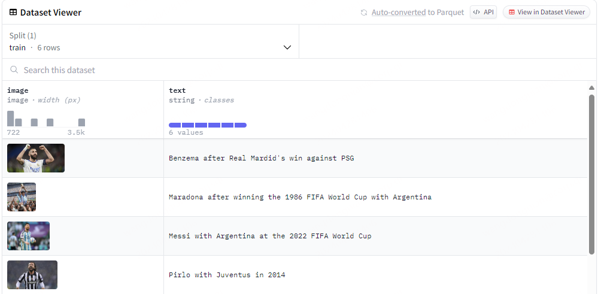
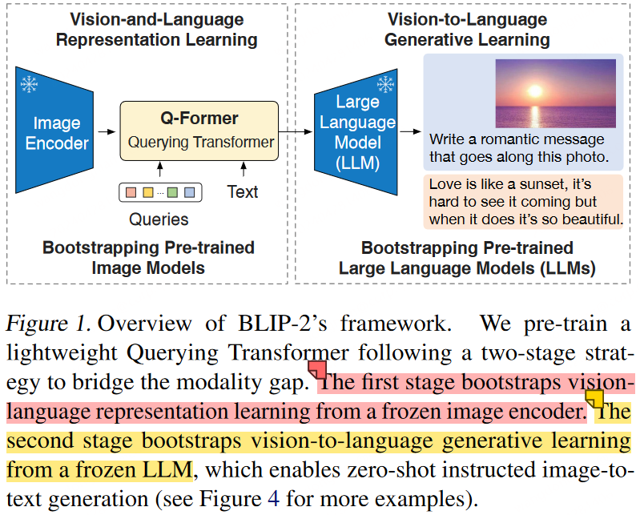
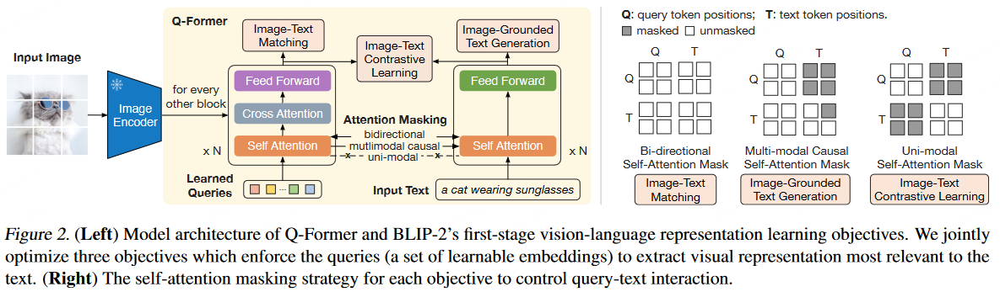
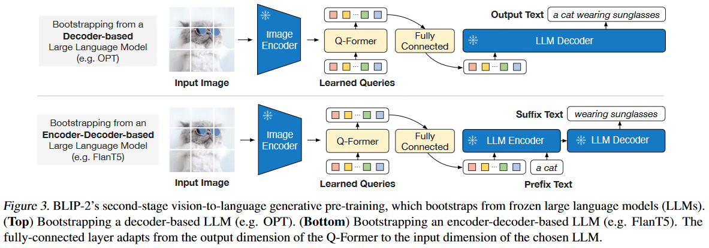

# 基于LoRA微调多模态大模型

本文将结合使用 LoRA 来训练用于图生文的blip2-opt-2.7b模型。

## 1.数据集和模型准备

数据集使用6名足球运动员的虚拟数据集，带有可用于微调任何图像描述模型的文字说明。数据集下载地址：[https://huggingface.co/datasets/ybelkada/football-dataset](https://huggingface.co/datasets/ybelkada/football-dataset "https://huggingface.co/datasets/ybelkada/football-dataset")



模型为利用 OPT-2.7B 训练的 BLIP-2 模型，其由三个模型组成，下面会详细介绍，模型下载地址：[https://huggingface.co/Salesforce/blip2-opt-2.7b](https://huggingface.co/Salesforce/blip2-opt-2.7b "https://huggingface.co/Salesforce/blip2-opt-2.7b")

## 2.BLIP-2 简介

**BLIP-2** 通过利用预训练的视觉模型和语言模型来提升多模态效果和降低训练成本，预训练的视觉模型能够提供高质量的视觉表征，预训练的语言模型则提供了强大的语言生成能力。如下图所示，由一个预训练的 **Image Encoder**，一个预训练的 **Large Language Model** 和一个可学习的 **Q-Former** 组成。



- **Image Encoder**：负责从输入图片中提取视觉特征。
- **Large Language Model**：负责文本生成。
- **Q-Former**：负责弥合视觉和语言两种模态的差距，由**Image Transformer**和**Text Transformer**两个子模块构成，它们共享相同自注意力层，如下图所示。
- **Image Transformer**通过与图像编码器进行交互提取视觉特征，它的输入是可学习的 Query，这些Query通过自注意力层相互交互，并通过交叉注意力层与冻结的图像特征交互，还可以通过共享的自注意力层与文本进行交互。
- **Text Transformer**作为文本编码器和解码器，它的自注意力层与Image Transformer共享，根据预训练任务，应用不同的自注意力掩码来控制Query和文本的交互方式。



为了减少计算成本并避免灾难性遗忘的问题，**BLIP-2 在预训练时冻结预训练图像模型和语言模型**，但是，简单地冻结预训练模型参数会导致视觉特征和文本特征难以对齐，为此BLIP-2提出两阶段预训练 Q-Former 来弥补模态差距：**表示学习阶段和生成学习阶段**。

### （1）**表示学习阶段**

在表示学习阶段，**将 Q-Former 连接到冻结的 Image Encoder**，训练集为`图像-文本`对，通过联合优化三个预训练目标，在Query和Text之间分别采用不同的注意力掩码策略，从而控制Image Transformer和Text Transformer的交互方式。

### （2）**生成学习阶段**

在生成预训练阶段，**将 Q-Former连接到冻结的 LLM，以利用 LLM 的语言生成能力**。这里使用全连接层将输出的 Query 嵌入线性投影到与 LLM 的文本嵌入相同的维度，然后，将投影的Query嵌入添加到输入文本嵌入前面。由于 Q-Former 已经过预训练，可以提取包含语言信息的视觉表示，因此它，可以有效地充当信息瓶颈，将最有用的信息提供给 LLM，同时删除不相关的视觉信息，减轻了 LLM 学习视觉语言对齐的负担。



该模型可用于如下的任务：图像描述生成、视觉问答任务、通过将图像和之前的对话作为提示提供给模型来进行类似聊天的对话。

先预先准备Processor、模型和图像输入。

```python
from PIL import Image
import requests
from transformers import Blip2Processor, Blip2ForConditionalGeneration
import torch

device = "cuda" if torch.cuda.is_available() else "cpu"

processor = Blip2Processor.from_pretrained("Salesforce/blip2-opt-2.7b")
model = Blip2ForConditionalGeneration.from_pretrained(
    "Salesforce/blip2-opt-2.7b", load_in_8bit=True, device_map={"": 0}, torch_dtype=torch.float16
)  # doctest: +IGNORE_RESULT

url = "http://images.cocodataset.org/val2017/000000039769.jpg"
image = Image.open(requests.get(url, stream=True).raw)
```

对于图像描述生成任务示例如下：

```python
inputs = processor(images=image, return_tensors="pt").to(device, torch.float16)

generated_ids = model.generate(**inputs)
generated_text = processor.batch_decode(generated_ids, skip_special_tokens=True)[0].strip()
print(generated_text)

# two cats laying on a couch
```

对于视觉问答任务（VQA）示例如下：

```python
prompt = "Question: how many cats are there? Answer:"
inputs = processor(images=image, text=prompt, return_tensors="pt").to(device="cuda", dtype=torch.float16)

generated_ids = model.generate(**inputs)
generated_text = processor.batch_decode(generated_ids, skip_special_tokens=True)[0].strip()
print(generated_text)
# two
```

## 3.LoRA 简介

LoRA方法的核心思想就是通过低秩分解来模拟参数的改变量，从而以极小的参数量来实现大模型的间接训练。

## 4.模型微调

第一步，加载预训练Blip-2模型以及processor。

```python
from transformers import AutoModelForVision2Seq, AutoProcessor

# We load our model and processor using `transformers`
model = AutoModelForVision2Seq.from_pretrained(pretrain_model_path, load_in_8bit=True)
processor = AutoProcessor.from_pretrained(pretrain_model_path)
```

第二步，创建 LoRA 微调方法对应的配置；同时，通过调用 `get_peft_model` 方法包装基础的 Transformer 模型。

```python
from peft import LoraConfig, get_peft_model

# Let's define the LoraConfig
config = LoraConfig(
    r=16,
    lora_alpha=32,
    lora_dropout=0.05,
    bias="none",
)

# Get our peft model and print the number of trainable parameters
model = get_peft_model(model, config)
model.print_trainable_parameters()
```

第三步，进行模型微调。

```python
# 设置优化器
optimizer = torch.optim.AdamW(model.parameters(), lr=5e-5)
device = "cuda"if torch.cuda.is_available() else"cpu"
model.train()
for epoch in range(11):
    print("Epoch:", epoch)
    for idx, batch in enumerate(train_dataloader):
        input_ids = batch.pop("input_ids").to(device)
        pixel_values = batch.pop("pixel_values").to(device, torch.float16)

        outputs = model(input_ids=input_ids, pixel_values=pixel_values, labels=input_ids)
        loss = outputs.loss
        print("Loss:", loss.item())
        loss.backward()
        optimizer.step()
        optimizer.zero_grad()

        if idx % 10 == 0:
            # 根据图像生成文本
            generated_output = model.generate(pixel_values=pixel_values)
            # 解码
            print(processor.batch_decode(generated_output, skip_special_tokens=True))
```

最后，保存训练的Adapter模型权重及配置文件。

```python
model.save_pretrained(peft_model_id)
```

## 5.模型推理

为了不影响阅读体验，详细的代码放置在GitHub：llm-action 项目中blip2\_lora\_inference.py文件。直接运行`CUDA_VISIBLE_DEVICES=0 python blip2_lora_inference.py`即可完成图生文。

```python

import torch
from datasets import load_dataset
from torch.utils.data import DataLoader, Dataset
from transformers import AutoModelForVision2Seq, AutoProcessor

from peft import LoraConfig, get_peft_model
from peft import PeftModel, PeftConfig
import torch
import requests
from PIL import Image
from transformers import Blip2Processor, Blip2ForConditionalGeneration


peft_model_id = "/workspace/output/multimodal/blip2"
config = PeftConfig.from_pretrained(peft_model_id)
processor = Blip2Processor.from_pretrained(config.base_model_name_or_path)

model = AutoModelForVision2Seq.from_pretrained(config.base_model_name_or_path, load_in_8bit=True, device_map="auto")
model = PeftModel.from_pretrained(model, peft_model_id)


train_dataset_path = "/workspace/data/pytorch_data/multimodal/blip2/ybelkada___football-dataset/default-80f5618dafa96df9/0.0.0/0111277fb19b16f696664cde7f0cb90f833dec72db2cc73cfdf87e697f78fe02"

dataset = load_dataset(train_dataset_path, split="train")

# Let's load the dataset here!
#dataset = load_dataset("ybelkada/football-dataset", split="train")


item = dataset[0]

device = "cuda" if torch.cuda.is_available() else "cpu"
model.eval()


encoding = processor(images=item["image"], padding="max_length", return_tensors="pt")
# remove batch dimension
encoding = {k: v.squeeze() for k, v in encoding.items()}
encoding["text"] = item["text"]

print(encoding.keys())

processed_batch = {}
for key in encoding.keys():
    if key != "text":
        processed_batch[key] = torch.stack([example[key] for example in [encoding]])
    else:
        text_inputs = processor.tokenizer(
            [example["text"] for example in [encoding]], padding=True, return_tensors="pt"
        )
        processed_batch["input_ids"] = text_inputs["input_ids"]
        processed_batch["attention_mask"] = text_inputs["attention_mask"]


pixel_values = processed_batch.pop("pixel_values").to(device, torch.float16)
print("----------")
generated_output = model.generate(pixel_values=pixel_values)
print(processor.batch_decode(generated_output, skip_special_tokens=True))
```
