# 1.sora技术原理解析

## 1.Sora简介

Sora是一个基于大规模训练的文本控制视频生成扩散模型。 Sora能够生成高达1分钟的高清视频，涵盖广泛的视觉数据类型和分辨率。 Sora使用简单的文本描述，使得视频创作变得前所未有的简单和高效。

### 1.1 Sora的一些能力

-   Text-to-video: 文生视频
-   Image-to-video: 图生视频
-   Video-to-video: 改变源视频风格or场景
-   Extending video in time: 视频拓展(前后双向)
-   Create seamless loops: Tiled videos that seem like they never end
-   Image generation: 图片生成 (size最高达到 2048 x 2048)
-   Generate video in any format: From 1920 x 1080 to 1080 x 1920 视频输出比例自定义
-   Simulate virtual worlds: 链接虚拟世界，游戏视频场景生成
-   Create a video: 长达60s的视频并保持人物、场景一致性

### 1.2 Sora解决的痛点

-   解决了文生视频中长视频的痛点，原来的只支持4S，Sora能支持60S。Sora在长视频中能保持人物/场景的高度一致性。
-   实现多视频的丝滑的整合，也就是做视频融合的能力。
-   同一场景的多角度/镜头的生成能力
-   具有动态摄像机运行的视频。人，场景在三维空间中一致地移动。
-   支持任意分辨率，宽高比的视频输出。

### 1.3 Sora存在的局限性

-   Sora对物理规律的理解仍然十分有限

## 2.Sora模型训练

### 2.1 Sora技术报告

Sora要做一个世界模拟器

部分原文：

```text
Video generation models as world simulators

We explore large-scale training of generative models on video data. Specifically, we train text-conditional diffusion models jointly on videos and images of variable durations, resolutions and aspect ratios. We leverage a transformer architecture that operates on spacetime patches of video and image latent codes. Our largest model, Sora, is capable of generating a minute of high fidelity video. **Our results suggest that scaling video generation models is a promising path towards building general purpose simulators of the physical world.**
```

原文链接：[https://openai.com/research/video-generation-models-as-world-simulators](https://openai.com/research/video-generation-models-as-world-simulators "https://openai.com/research/video-generation-models-as-world-simulators")

### 2.2 模型训练流程

1.  Visual Encoder : 原始视频数据被切分为 Pathes，通过VAE编码器压缩成低维空间表示；
2.  Transformer Decoder : 把文本信息生成一维向量
3.  基于 Diffusion Transformer 完成从文本语义到图像语义的再映射；
4.  DiT 生成的低维空间表示，通过 VAE 解码器恢复成像素级的视频数据。

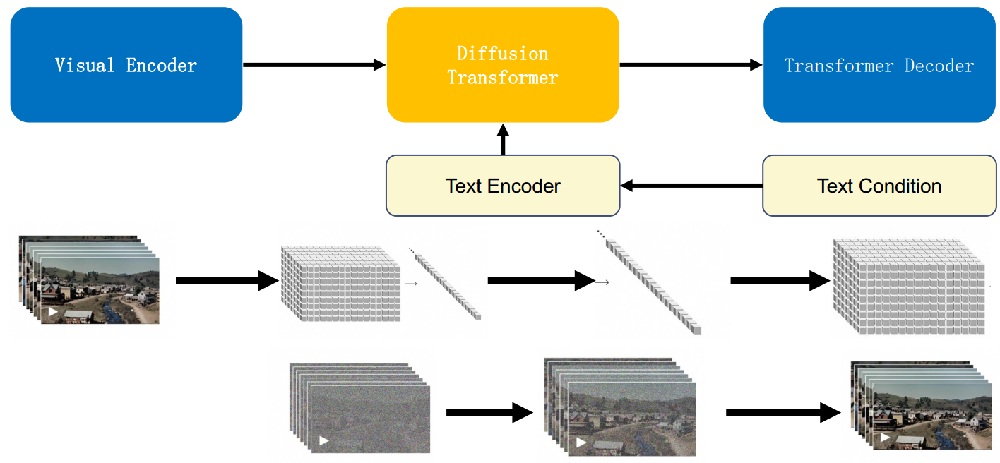

-   Step 1 : 使用DALLE 3 (CLIP) 把文本和图像对 \<text, image>联系起来；
-   Step 2 : 视频数据切分为 Patches 通过VAE编码器压缩成低维空间表示；
-   Step 3 : 基于 Diffusion Transformer 从图像语义生成，完成文本语义到图像语义进行映射；
-   Step 4 : DiT生成的低维空间表示，通过VAE解码器恢复成像素级的视频数据。

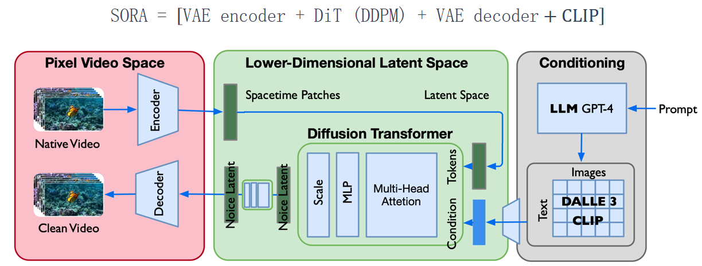

### 2.3 视频数据统一表示（Transforming Visual Data into Patches）

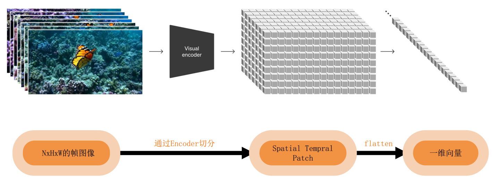

Sora是一个在不同时长、分辨率和宽高比的视频及图像上训练而成的扩散模型，同时采用了Transformer架构

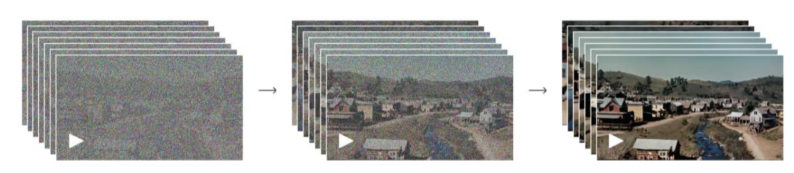

### 2.4 扩散模型DDPM

扩散模型示意图：

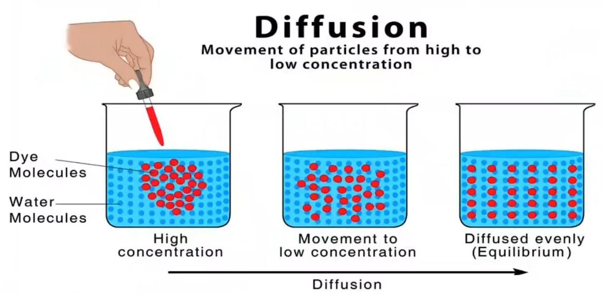

模型训练：DDPM (Doiseing Diffusion Probabilistic models)

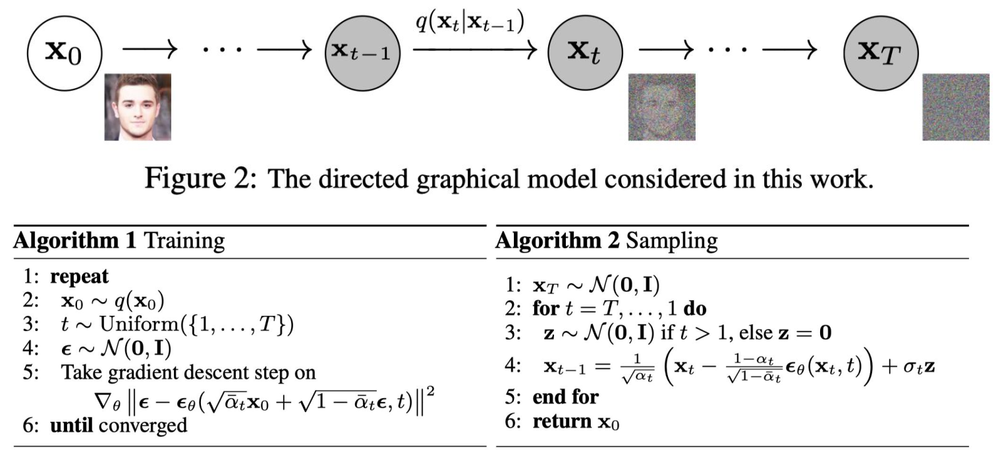

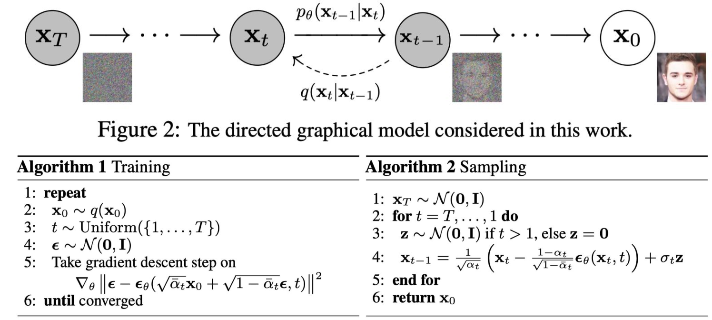

DDPM的整个工作流程

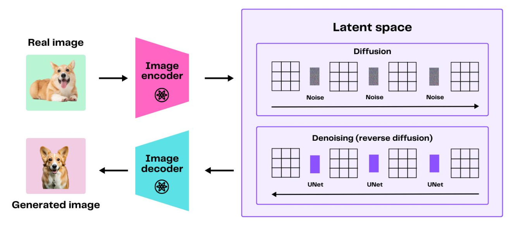

### 2.5 基于扩散模型的主干网络

1.  U-Net 网络模型结构把模型规模限定；U-Net使用CNN搭建的。
2.  SD/SDXL 作为经典网络只公布了推理和微调；
3.  国内主要基于 SD/SDXL 进行二次创作

#### **Diffusion Process过程**

1.  给图像增加噪声
2.  文本对向量化；
3.  把两个都放在U-Net中去训练

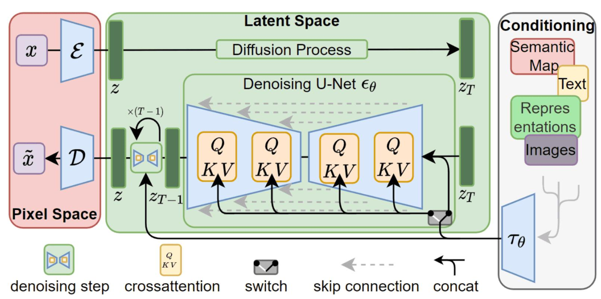

#### Sora模型架构

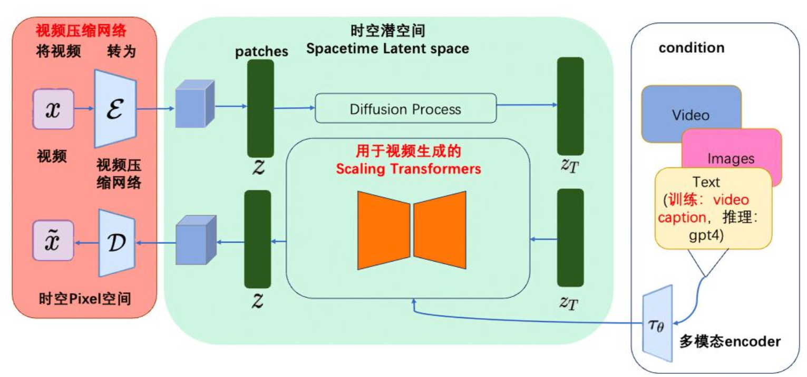

## 3.关键技术

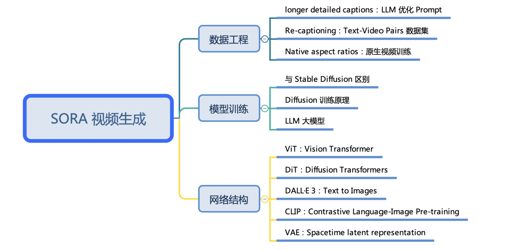

### 3.1 ViT

-   ViT 尝试将标准 Transformer 结构直接应用于图像；
-   图像被划分为多个 patch后，将二维 patch 转换为一维向量作为 Transformer 的输入

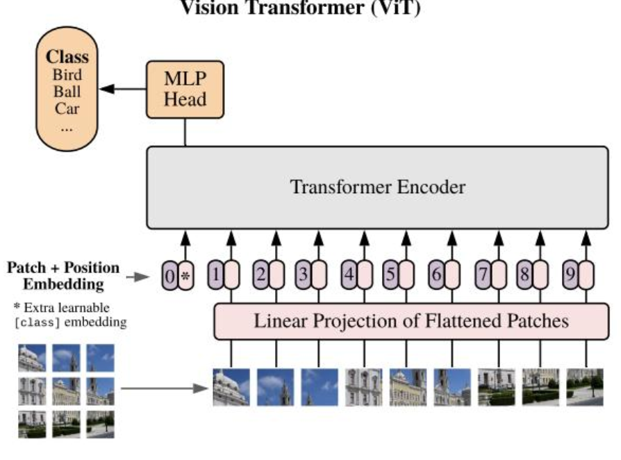

### 3.2 在图片处理基础上处理视频的模型 ViViT模型（google提出的）

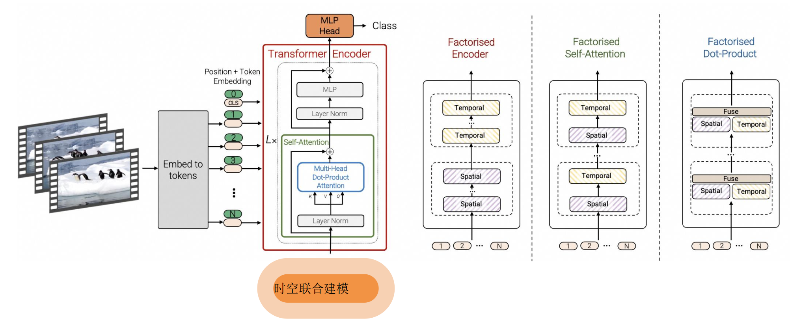

### 3.3 时空编码（Spacetime latent patches）

在时间和空间两个维度上，对视频进行编码

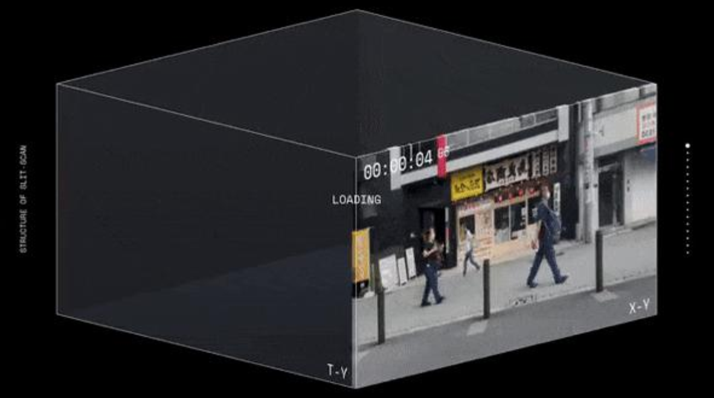

#### （1）摊大饼法

从输入视频剪辑中均匀采样 n\_t 个帧，使用与ViT相同的方法独立地嵌入每个2D帧(embed each 2D frame independently using the same method as ViT)，并将所有这些token连接在一起

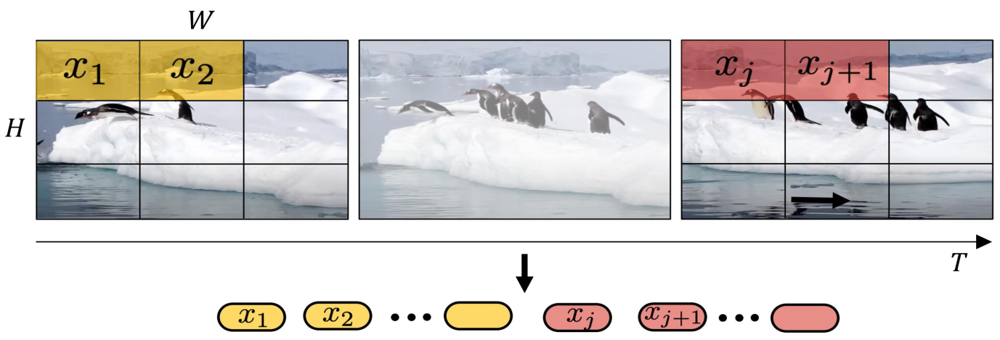

#### （2）切块法

将输入的视频划分为若干个tuplet，每个tuplet会变成一个token

经过Spatial Temperal Attention 进行空间/时间建模获得有效的视频表征token，即下图灰色部分。

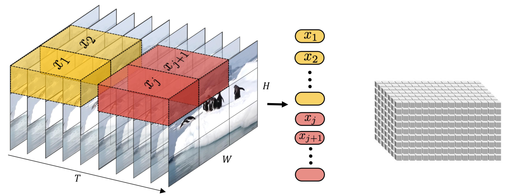

### 3.4 Sora不同长度，分辨率

&#x20;Sora支持不同长度，不同分辨率的输入 NaViT(google)，还支持去重的功能。

技术难点：视频压缩网络，Encoder的复杂度、时空交互的range

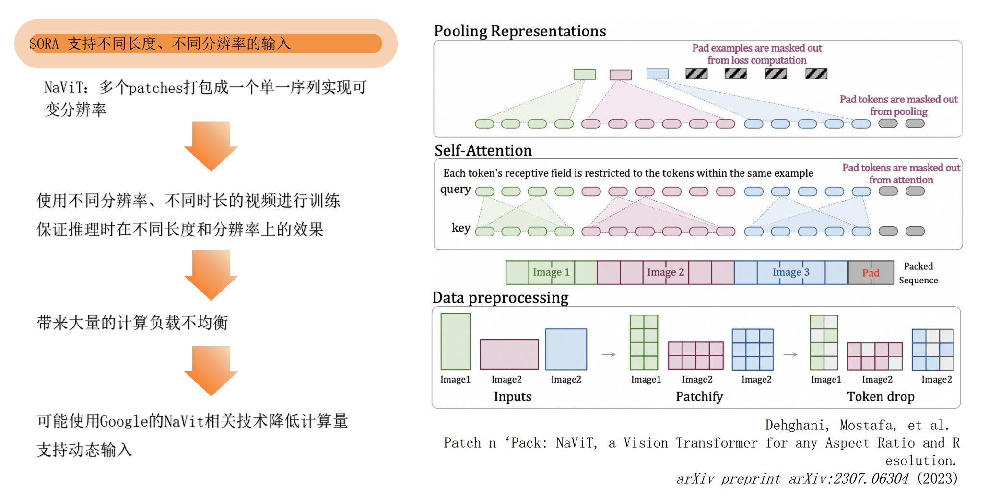

### 3.5 DiT

结合 Diffusion Model 和 Transformer， 通过 Scale up Model 提升图像生成质量图像的scaling技术运用到视频场景非常直观， 可以确定是 SORA 的技术之一

**Diffusion Transformer = VAE encoder + ViT + DDPM + VAE**

DiT 利用 transformer 结构探索新的扩散模型，成功用 transformer 替换 U-Net 主干

1.  DiT 首先将将每个 patch 空间表示  Latent 输入到第一层网络，以此将空  间输入转换为 tokens 序列。 &#x20;
2.  将标准基于 ViT 的 Patch 和  Position Embedding 应用于所有输入  token，最后将输入 token 由 Transformer 处理。 &#x20;
3.  DiT 还会处理额外信息，e.g. 时间步长、类别标签、文本语义等

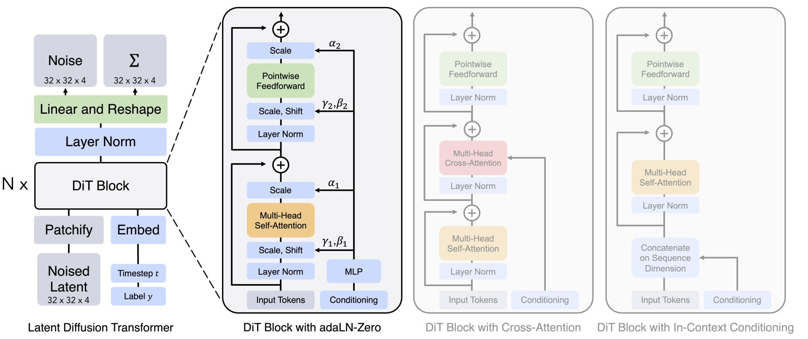

DiT示例

```c++
• 例如输入一张256x256x3的图片,经过Encoder后得到对应的latent
• 推理时输入32x32x4的噪声,得到32x32x4的latent
• 结合当前的 step t , 输入label y , 经过N个Dit Block通过 MLP 进行输出
• 得到输出的噪声以及对应的协方差矩阵
• 经过T个step采样,得到32x32x4的降噪后的latent
• 在训练时， 需要使得去躁后的latent和第一步得到的latent尽可能一致
```

技术难点：工程化是非常难的。1.Transformer Scale up到多大？2.从头训练到收敛的trick？3.如何实现长视频的支持；4.如何保证视频中实体的高质量和一致性？

### 3.6 用Patch预测下一个Patch

OpenAI视频的生成路径：用Patch预测下一个Patch

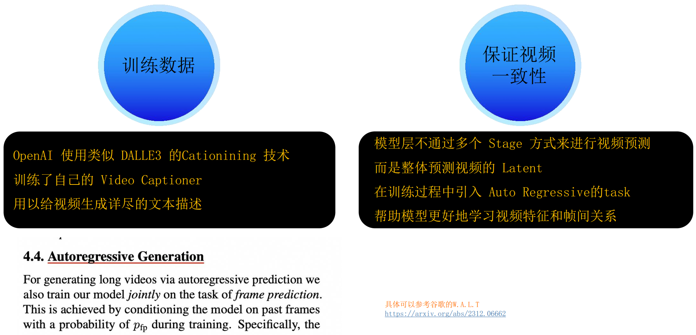

### 3.7 DALLE 2

Sora对文本对的训练使用了DALLE 2

1.  将文本提示输入文本编码器，该训练过的编码器便将文本提示映射到表示空间； &#x20;
2.  先验模型将文本编码映射到图像编码，图像编码捕获文本编码中的语义信息； &#x20;
3.  图像解码模型随机生成一幅从视觉上表现该语义信息的图像；

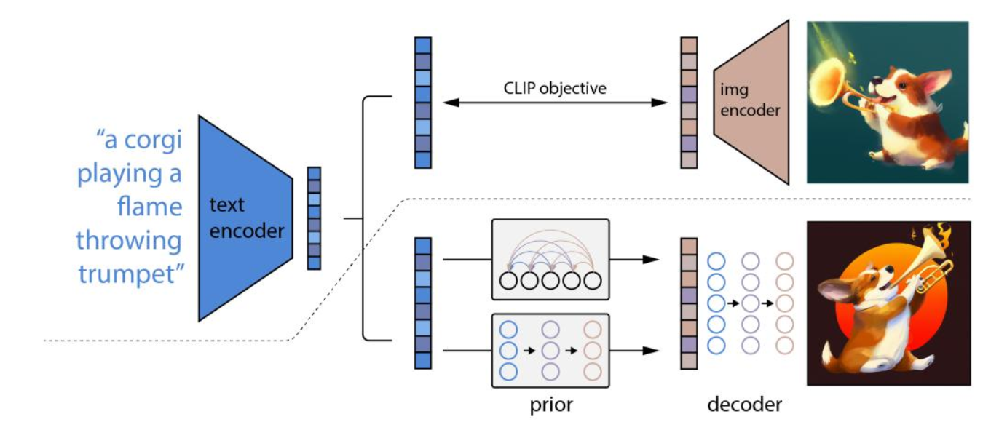

## 4.技术总结

1.  **Scaling Law**：**模型规模的增大**对视频生成质量的提升具有明确意义，从而很好地解决视频一致性、连续性等问题； &#x20;
2.  **Data Engine**：**数据工程很重要**，如何设计视频的输入（e.g. 是否截断、长宽比、像素优化等）、patches 的输入方式、文本描述和文本图像对质量；&#x20;
3.  **AI Infra**：**AI 系统（AI 框架、AI 编译器、AI 芯片、大模型）工程化**能力是很大的技术壁垒，决定了 Scaling 的规模。 &#x20;
4.  **LLM**：LLM 大语言模型仍然是核心，多模态（文生图、图生文）都需要文本语义去牵引和约束生成的内容，CLIP/BLIP/GLIP 等关联模型会持续提升能力

## 参考资料

1.  [https://datawhaler.feishu.cn/file/KntHbV3QGoEPruxEql2c9lrsnOb](https://datawhaler.feishu.cn/file/KntHbV3QGoEPruxEql2c9lrsnOb "https://datawhaler.feishu.cn/file/KntHbV3QGoEPruxEql2c9lrsnOb")


