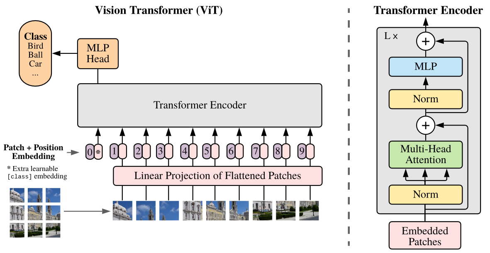
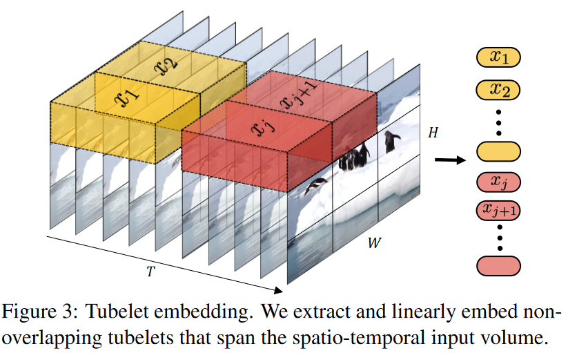
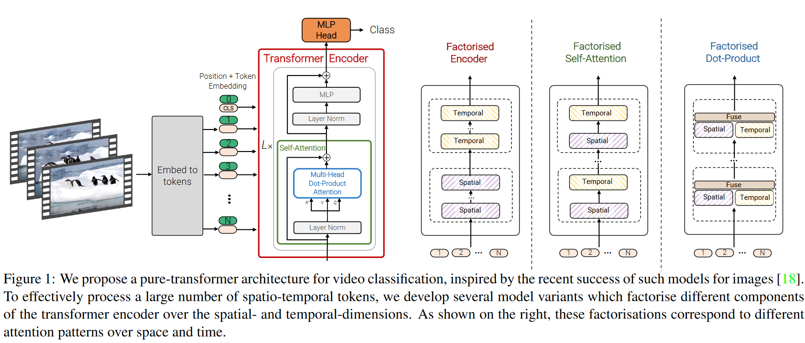
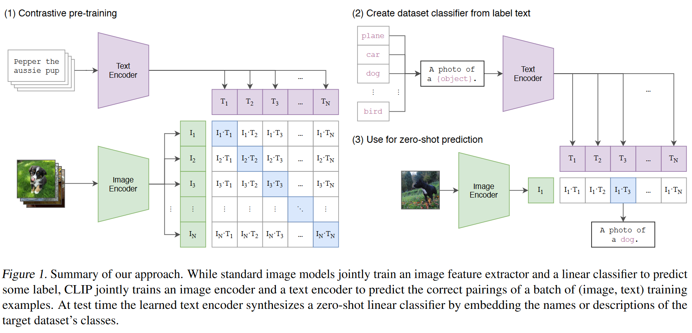
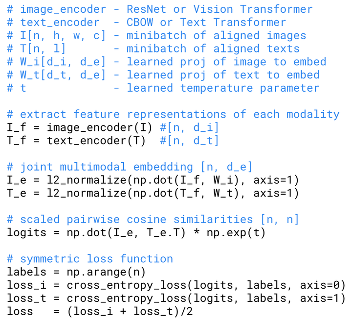
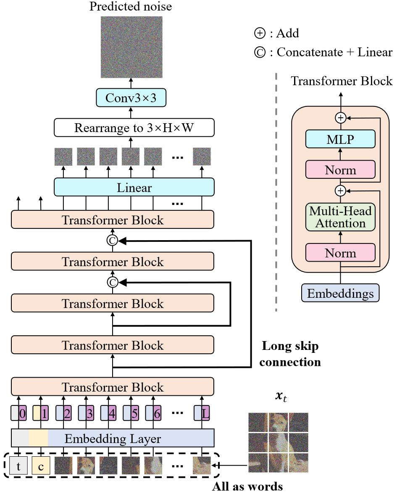
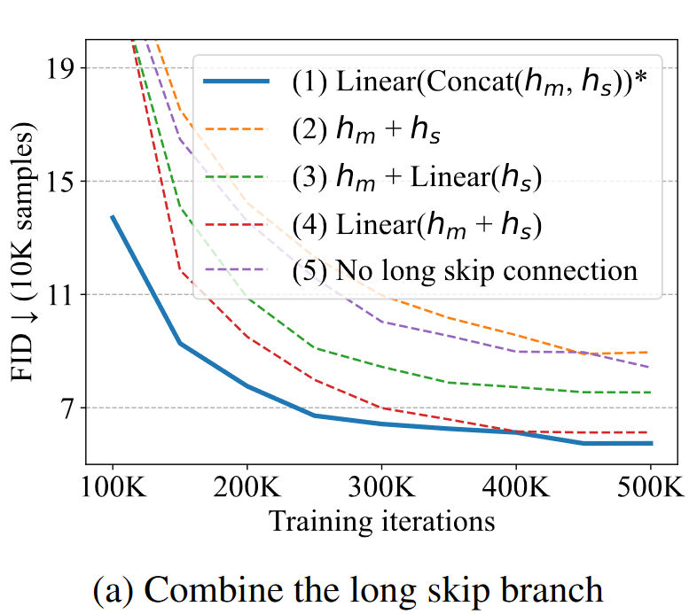
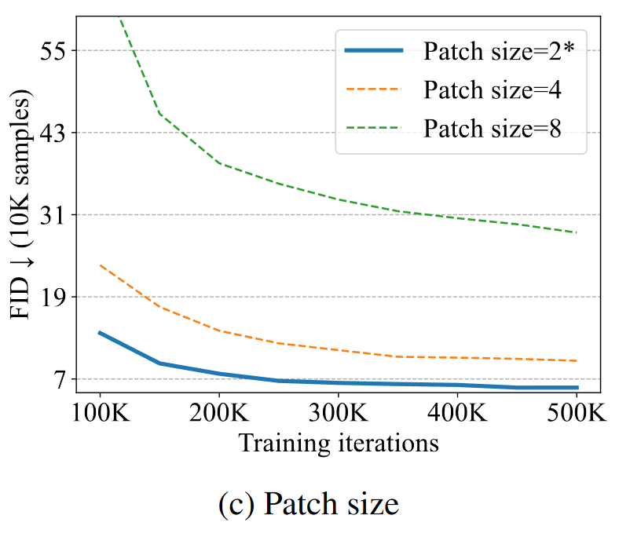
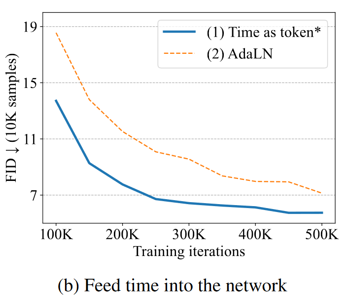

# 2.Transformers diffusion

## 1.视觉预训练论文

### 1.1 ViT

> *An Image is Worth 16x16 Words: Transformers for Image Recognition at Scale*

和Transformer在LLM中的地位一样，ViT通常作为LVM的组件使用。**该模型将图像块类比为单词，被设计成了一个"进行句子分类任务的BERT"**。然而，与BERT的自监督学习不同，ViT在预训练过程中采用了基于ImageNet数据集的有监督学习方法。

ViT原论文中最核心的结论是，**当训练数据集规模不足时，ViT的表现通常略逊于同等大小的ResNets**。这是因为相较于CNN，Transformer缺少一些归纳偏置。CNN具有两种归纳偏置，一是**局部性**：图片上相邻区域具有相似特征；二是**平移不变性**：卷积后平移和平移后卷积结果等效。这些归纳偏置为模型提供了更多先验信息，使得使用较少数据就能学习到良好模型。然而，当拥有足够大规模的数据集进行预训练时，ViT能够突破Transformer缺少归纳偏置的限制，并在下游任务中取得非常好的迁移效果。

#### （1）ViT对输入的预处理

| 输入预处理步骤     | BERT                  | ViT                       |
| ----------- | --------------------- | ------------------------- |
| 输入          | 固定长度的一段文本序列           | 固定词向量大小的图像序列, 长度为         |
| 向量嵌入        | 固定的词向量嵌入、可学习的位置嵌入、段嵌入 | 可学习的词向量嵌入(线性投影层)、可学习的位置嵌入 |
| `<cls>`特殊词元 | 最前端位置，固定嵌入向量          | 最前端位置，可学习嵌入向量             |

注：在ViT中，使用可学习的向量来表示`<cls>`词元而不是像BERT那样使用固定的向量：**因为预训练是有监督的**，使用可学习的向量来表示词元可以使模型更好地适应具体任务的特征。

在代码中，没有在向量和编码器输入之间添加全连接层，这样做为什么没有导致向量参数更新不稳定：ViT使用了一种称为"学习率预调整"的技巧，该技巧有助于稳定模型的训练过程。

#### （2）ViT在大语言模型中的使用

### 1.2 ViViT：视频ViT

> ViViT: A Video Vision Transformer

ViViT 使用了**时空图像块（spatial-temporal patch）** 和为处理时序关系而专门设计的 Transformer 架构，

**时空图像块**\*\*:\*\* ViViT 认识到了视频本质上是三维数据，其中时间是一个关键的维度。它将视频分割为时空图像块，这样模型就能同时学习视频中的空间细节与时间动态。

**Transformer 中的时序组件**\*\*:\*\* ViViT 使用了一种能处理这些时空图像块的 Transformer 架构。这种做法让模型能学习帧与帧之间的复杂空间与时间关系，而这正是理解和生成视频的重要能力。

### 1.3 CLIP

> *Learning Transferable Visual Models From Natural Language Supervision*

#### （1）文本作为监督信号的好处

预训练的本质是学习一个压缩器，该压缩器通过**挖掘不同数据之间的相似性并以高维结构表示这种相似性进行数据压缩**。传统的有监督学习方法通过标签来定义这种相似性：使用压缩器将图像压缩到标签空间，并通过标签进行对齐。然而，这种经典做法存在一些问题：

1.  在标签空间中，各个标签向量是正切的，这可能导致过度对齐图像。就像实例相关的标签噪声一样，某些图片可能与多个类别非常相似，将其对齐到单一类别会导致大量语义信息的损失。
2.  标签空间需要事先定义。传统的`<图像,类别>`样本形式要求在训练之前定义一个固定的标签空间，这使得预训练模型无法泛化到涉及其他视觉概念的图片上。

**文本作为语义丰富的标签**解决了上述两个问题。

因此，**CLIP模型采用文本作为监督信号**，属于多模态学习的领域。该模型将**文本和图像映射到一个共同的隐空间，以实现它们在语义上的对齐**。与传统视觉概念相比，语义丰富的文本缺少了一些“归纳偏置”，例如文本标签不是独热向量，并且不同的文本标签之间也不是正交的。为了解决这个问题，像ViT一样，CLIP采用了海量的`<图像，文本描述>`样本进行训练。

#### （2）CLIP的架构

需要注意的是在这种多模态架构中，模型建模的不是$P(y|x)$，而是$P(d|x,y)$, 其中$d$表示他们是否属于同一个概念。

CLIP是一个**由图像编码器和文本编码器的双流网络**。如果编码器是ViT(图像)或者BERT(文本), 那么`<cls>`位置上的嵌入向量被用作表示整个图像或文本的特征向量。

CLIP通过一个线性层将两个模态的向量映射到一个空间后，形成了一个矩阵。对于图像向量$I_1$来说，它与$T_1$构成正样本对，与其他`n-1`个$T_j$构成负样本对；对于文本向量$T_1$来说，它与$I_1$构成正样本对，与其他`n−1`个$I_j$构成负样本对；因此这个矩阵的对角损失损失$L$可以分为两个损失$L_1$和$L_2$，具体见下图。

## 2.U-ViT论文

> Paper: [All are Worth Words: A ViT Backbone for Diffusion Models](https://link.zhihu.com/?target=https://arxiv.org/abs/2209.12152 "All are Worth Words: A ViT Backbone for Diffusion Models")
> Code: [https://github.com/baofff/U-ViT](https://link.zhihu.com/?target=https://github.com/baofff/U-ViT "https://github.com/baofff/U-ViT")

### 2.1 Backbone in Diffusion Model

-   2015 → Diffusion Probabilistic Models → MLP
-   2019 → Score based model → U-Net
-   2020\~2022 → DDPM, ADM, Imagen, Stable Diffusion → Improved U-Net
-   2022 → U-ViT, DiT → ViT

U-ViT将扩散概率模型和Transformer结合，主要展现了以下两类能力：

-   图像生成的SOTA FID 分数
-   多模态数据的融合

### 2.2 U-ViT网络结构

U-ViT延续了ViT的方法，将带噪图片划分为多个patch之后，将时间$t$，条件$c$，和图像$patch$视作token输入到Transformer block，同时在网络浅层和深层之间引入**long skip connection**。

#### （1）Long skip connection

直观上理解，扩散概率模型中的噪声预测网络是像素级别的预测任务，对low-level feature敏感，long skip connection为连接low-level feature提供了快捷方式，所以有助于网络的训练。 对于网络主分支的特征$h_{m} \in \mathbb{R}^{B, L, D}$和来自long skip connection的特征 $h_{s} \in \mathbb{R}^{B, L, D}$，，其中B为batch\_size，L为token 数目，D为每一个token的长度。作者探究了以下几种融合$  h_m $, $h_s$的方式。

可以看出，long skip connection对于图像生成的FID分数是至关重要的。

#### （2）Patch size

假设patch size为$p$，图像分辨率为$I\times I$，则输入Transformer的token数目$L=\left(\frac{I}{p}\right)^{2}$，patch size 减少为一半，token数目增加为4倍，在一般情况下，模型的GFLOPs 也增加为4倍。所以即使在相同参数量的情况下，patch size不同，训练或者推理所需的计算量也不同。作者探究了不同patch size对图像生成结果的影响。

#### （3）The way to feed the time into the network

作者探究了两种将衡量噪声大小的时间t嵌入网络的方法：

-   将时间t视作$token$
-   类似于adaptive group normalization，在LayerNorm后插入时间t，即$\operatorname{AdaLN}(h, t)=t_{s} LayerNorm (h)+t_{b}$，h是transfomer block的特征， $t_s$, $t_b$是t经过线性投影后得到的特征。

