# 从视觉表征到多模态大模型

> 原文链接：[一文看完多模态：从视觉表征到多模态大模型](https://zhuanlan.zhihu.com/p/684472814 "一文看完多模态：从视觉表征到多模态大模型")

本文对多模态和多模态大模型做一个系统的梳理，尝试以一个亲历者的视角谈谈这部分技术的发展思路，希望能给读者一些不一样的收获，如有偏颇，欢迎指正。

为了表述简单，不严谨的将“图文多模态”表述为“多模态”，如果后面有机会可以讨论更多模态的相关工作。此外，本文假设读者已经对视觉表征和多模态融合有一定入门背景，希望通过一篇文章回顾将过去几年的经典工作。

## 1.总览

由于是讲“图文多模态”，还是要从“图”和“文”的表征方法讲起，然后讲清楚图文表征的融合方法。对于文本模态的表征发展，在[《闲话NLP：文本表征的半世今生》](https://zhuanlan.zhihu.com/p/473195206 "《闲话NLP：文本表征的半世今生》")一文中有过一轮的梳理，因此本文只要讲两件事情：

-   **视觉表征**：分为两个部分问题，一是**如何合理建模视觉输入特征**，二是**如何通过预训练手段进行充分学习表征**，这两点是基于视觉完成具体算法任务的基础；
-   **视觉与自然语言的对齐（Visul Language Alignment）或融合**：目的是将视觉和自然语言建模到同一表征空间并进行融合，实现自然语言和视觉语义的互通，这点同样离不开预训练这一过程。模态对齐是处理多模态问题的基础，也是现在流行的多模态大模型技术前提。

对于视觉表征，从发展上可以分为卷积神经网络（CNN）和Vision Transformer（VIT）两大脉络，二者分别都有各自的表征、预训练以及多模态对齐的发展过程。而对于VIT线，另有多模态大模型如火如荼的发展，可谓日新月异。

因此，本文的行文思路也就非常简单，如图1所示。第一部分介绍以**CNN**为基础的视觉表征和预训练手段，以及在此基础上的多模态对齐的方法。由于预训练已经成为AI技术取得效果的标配，多模态对齐部分的内容也是以多模态预训练技术承载；第二部分从**VIT**技术出发，分别介绍VIT视觉表征的预训练探索工作、多模态对齐的预训练工作以及近两年火热的研究方向多模态大模型。

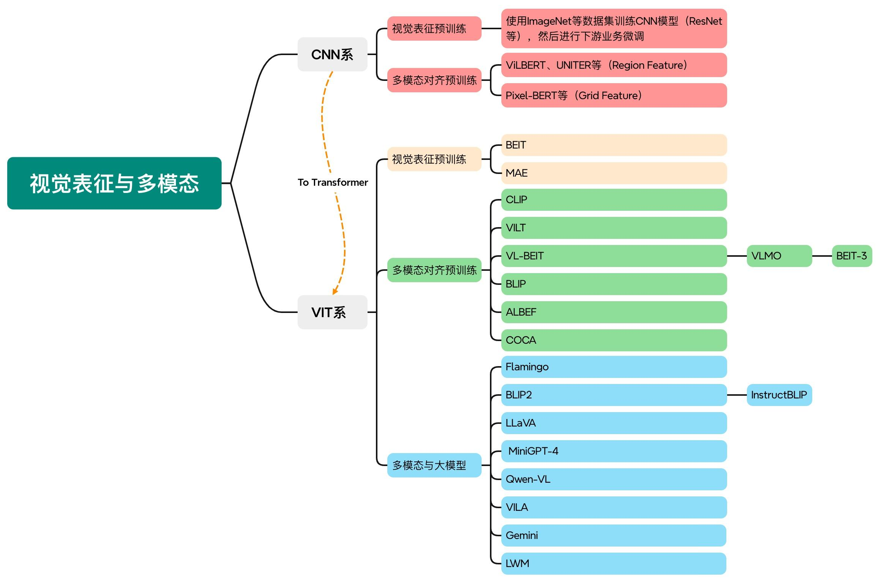

## 2.CNN：视觉理解的一代先驱

### 2.1 卷积视觉表征模型和预训练

对视觉信息的表征，简单来说是将图像信息转化成深度学习输入所需的特征向量或向量序列，如下图所示。深度学习时代，卷积神经网络（CNN）凭借其**局部区域连接**、**权重共享**以及**位移不变性**等特点，天然的符合了图像信息的建模归纳假设，成为早期最适合视觉表征的模型。具体的，卷积神经网络应用视觉表征的模型很多，简单从LeNet-5、AlexNet、VGG和ResNet等模型的演进一窥其在关键要素。

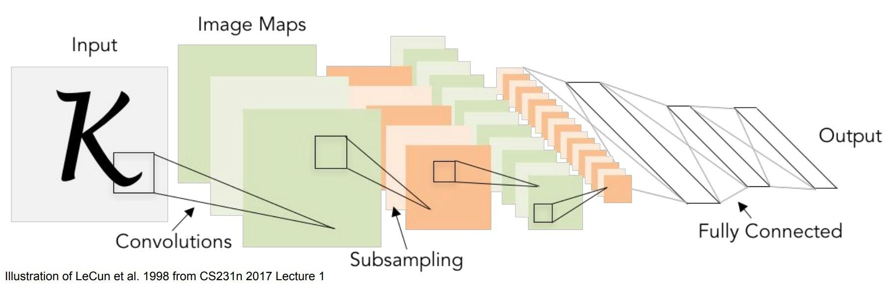

#### **（1）卷积视觉表征：从LeNet到ResNet**

LeNet-5早期在数字识别中取得了成功的应用，网络结构是 \[**CONV-POOL-CONV-POOL-FC-FC**]。卷积层使用 `5*5`的卷积核，步长为`1`；池化层使用 `2*2` 的区域，步长为`2`；后面是全连接层；AlexNet相比LeNet-5做了更多层数的堆叠，网络参数进行了相应的调整，并在ImageNet大赛2012夺得冠军；相应VGG网络使用更小的卷积核，同时相比AlexNet进一步提升了网络层数。

随着研究的深入，神经网络的层数也出现了爆发式地增长，由此也不可避免的带来梯度消失和梯度爆炸的问题，使得模型训练的困难度也随之提升。一种解决方法是**将神经网络某些层跳过下一层神经元的连接，隔层相连，弱化每层之间的强联系**。这种神经网络被称为Residual Network(ResNet)残差网络，网络结构的原理是将卷积层的堆叠，替换成跨层连接的模块，如图3所示。

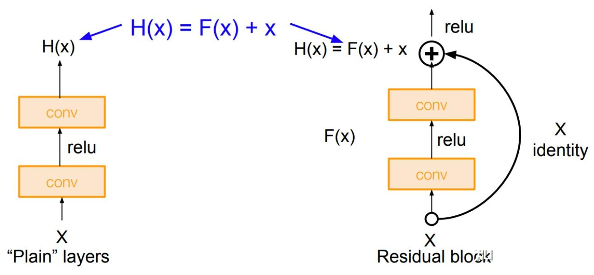

有了合理的建模模型，可以使用具体任务的训练数据学习视觉表征，进而完成不同的任务（如分类、分割、目标检测等）。而更加有效的方式通常是**先用“海量”的数据让模型学到通用的视觉表征，再进行下游具体任务数据的学习**，也就是**预训练+微调**的范式。

#### （2）卷积视觉预训练

在CNN视觉表征体系下，早期的视觉预训练有另一个叫法是**迁移学习**，在BERT的预训练+微调范式流行之前就已经被广泛应用。迁移学习中，**传统CNN视觉模型在做具体任务训练之前，先在大量的图像任务数据集上进行预先训练**（如ImageNet分类任务数据集等）。**然后使用预训练的CNN权重初始化Backbone，并增加一些任务定制网络模块，完成在下游任务上的微调**（如Backbone+全连接层做分类任务）。

卷积神经网络视觉表征和预训练的优化升级工作还有很多，介绍相关内容的资料也很多，篇幅原因我们对此不进行详细展开和概述，而是把更多的笔墨放在近几年更热门的研究方向上。

### 2.2 早期多模态融合与预训练

接着是CNN体系下的多模态融合和预训练，视觉和自然语言的跨模态对齐和融合有两种表现形式：**一种是双塔结构，多模态分别表征，通过对比学习机制实现视觉和文本在同一空间中的距离度量；另一种是视觉表征和文本表征通过交互型网络结构融合成多模态表征，进而完成下游任务应用****。** 由于前者可以看作后者的特例，用后一种表现形式为例，将二者统一，进而讲述以CNN为基础的早期多模态融合与预训练技术。

如下图所示，展示了上述的多模态融合框架，包括视觉特征提取模块、文本特征提取模块和模态融合模块。文本模块是常见的Token Embedding方式；视觉表征方面，由于CNN已经验证了有效性，因此大多数的工作在都考虑使用CNN做视觉特征抽取，得到高级语义特征，然后将高级语义表征作为输入，和文本Token Embedding序列一起输入到下游融合模块。不同工作的差异主要集中在**视觉特征提取CNN Backbone以及Modality Interaction两个模块**。

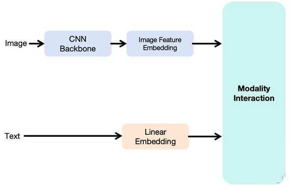

以2019年作为粗略分界点，在此之后BERT的训练范式开始流行，多模态方向上的研究热点则是借鉴BERT的成功，使用Transformer网络（特指Transformer Encoder）作为Modality Interaction模块把视觉和自然语言进行特征融合，并通过大规模预训练来学习得到多模态表征；而在此之前的方案通常是简单的多层全连接网络实现。

顺着这个思路，确定了使用Transformer作为模型融合模块这个大方向后，第二个问题是**如何对视觉特征进行有效编码，得到和文本一样的Token Embedding序列作为模型输入**？这一问题的解法在CNN为主的时期有两种主要方式，如下图所示：

-   **Region Feature Base**：先通过基于CNN的目标检测模型（Fast R-CNN等），识别图像中的关键物体区域集合（ROI，Region Of Interest），并提取区域的表征向量，作为Transformer模型的视觉输入Embedding序列。这么做的动机是，每个ROI区域，都有明确的语义表达（人、建筑、物品等），方便后续和文本特征的对齐。比较有代表性的工作如LXMERT、VL-BERT和UNITER等；
-   **Grid Feature Base**：区域特征方法虽然看上去合理，但是依赖前置的目标检测模型，整体链路较重。因此也有工作探索，不经过区域检测，直接使用CNN网络提取深层的像素特征作为交互模型输入，同样取得了一些成果。比较有代表性的工作如Pixel-Bert等。

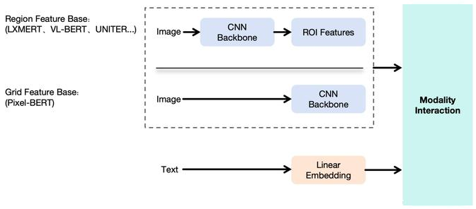

下面分别介绍这一时期的经典工作，了解其中基本思路和方法。

#### （1）LXMERT

LXMERT是早期进行多模态特征融合的工作之一，如图所示，模型采用经典的**两路深层表征输入结构**。

-   在视觉侧关注单图，**图像经过目标检测模型得到区域块的特征序列，又经过Transformer做进一步编码区域块之间的关系（Object-Relationship Encoder）**；
-   文本侧通过BERT结构得到文本的特征序列（Language Encoder）；
-   最后两者使用深层Transformer结构做交叉Attention，再进行多任务的预训练。

LXMERT的预训练任务相比BERT较多，包括Masked图像特征的预测、图像Label的预测（猫、狗等）、VQA、图文是否匹配以及纯文本侧的Masked语言模型（MLM）。

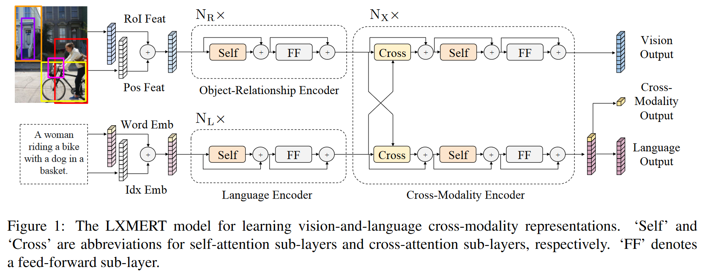

预训练模型经过特定任务微调后，LXMERT在两个视觉问答数据集（VQA和GQA）上达到了当时最先进的结果。作者还展示了LXMERT可以很好地泛化到一个具有挑战性的视觉推理任务（NLVR2），并将之前的最佳结果提高了22%（从54%到76%），是一个比较优秀的工作。

#### （2）VL-BERT

另一个Region Feature Base的经典工作是VL-BERT。如图所示，与LXMERT不同的是，VL-BERT属于单**路输入模式**，**视觉特征在经过目标检测模型进行Region特征提取后，直接和文本Embedding一起拼接输入到Transformer网络中进行多模态的交叉Attention**。

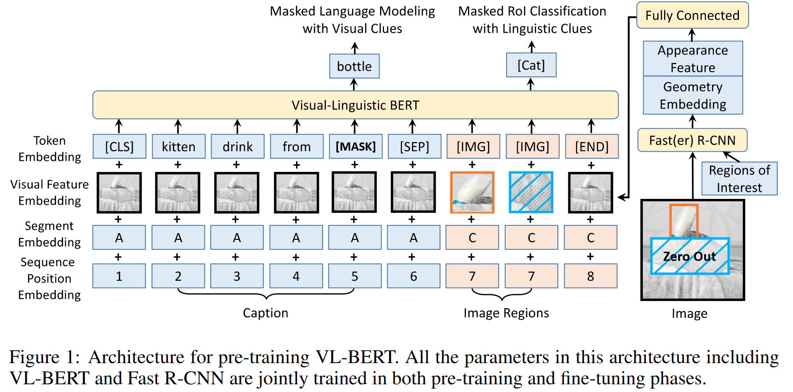

VL-BERT设计了两个预训练任务：**带视觉特征的掩码语言模型学习**（Masked Language Modeling with Visual Clues）、**带文本特征的视觉Region分类**（Masked RoI Classification with Linguistic Clues）。

经过预训练和微调流程，模型可以适用于多种视觉和语言任务，并在视觉问答、图像-文本检索、视觉常识推理等任务上都取得了非常不错的性能。VL-BERT印证了，多模态语义特征不需要各自的单独深度编码，直接做交互也可以取得有效结果。

### （3）UNITER

如图所示，UNITER使用和VL-BERT类似的架构，同样的单路架构，同样是目标检测模型做视觉的语义特征抽取，并进一步使用**更多的训练数据、更多的预训练任务**，希望得到一个更加通用的图文多模态表征模型。

UNITER通过在四个图像和文本数据集（COCO, Visual Genome, Conceptual Captions, and SBU Captions）上进行大规模的预训练，可以支持多种视觉和语言任务的联合多模态表征。

同时设计了四种预训练任务：**遮蔽语言建模（MLM**），**遮蔽区域建模（MRM，有三种变体）**，**图像-文本匹配（ITM）**，和**词-区域对齐（WRA）**。

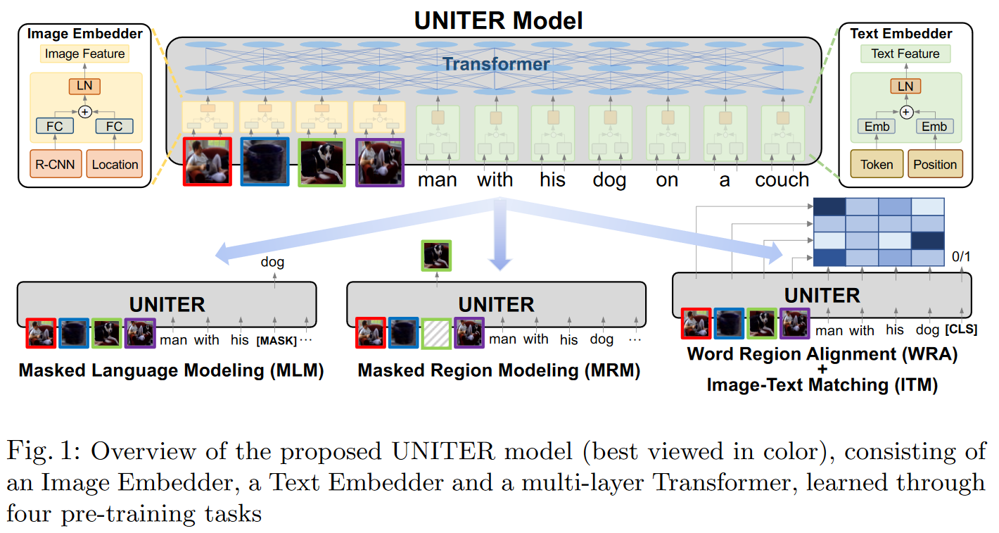

相比于之前方案，UNITER提出了通过最优传输（OT，Optimal Transport）的方法来进行WRA，在**预训练过程中显式地加强词和图像区域之间的细粒度对齐**。相比其他工作仅使用图像-文本匹配（ITM）的全局对齐方式，WRA更加精准。

经过大量的消融实验，UNITER还探索了预训练任务的最佳组合方式，并最终在视觉问答，图像-文本检索，指代表达理解，视觉常识推理，视觉蕴含，和NLVR2等任务上都达到了新的最先进的水平。

UNITER称得上是Region Feature Based多模态预训练的集大成者，同时期的大多数工作也多是类似结构上的修补或增强。但也不乏另辟蹊径的工作，其中以Grid Feature Based相关工作最具影响力。

#### （4）Pixel-BERT

Pixel-BERT是**Grid Feature Based**多模态融合代表工作之一。如图所示，与Region Feature Based方法不同的是，**Pixel-BERT不需要使用目标检测模型进行ROI区域的特征抽取，而是直接通过卷积网络提取图片的像素级别特征，直觉和文本特征一起输入到下游的Transformer网络**进行特征融合。**这种方式****减少了目标检测区域框标注的成本，同时缓解了视觉语义label与文本语义的不均衡问题**（区域框的物体类别往往上千规模，而文本可以表达的语义远不止于此）。

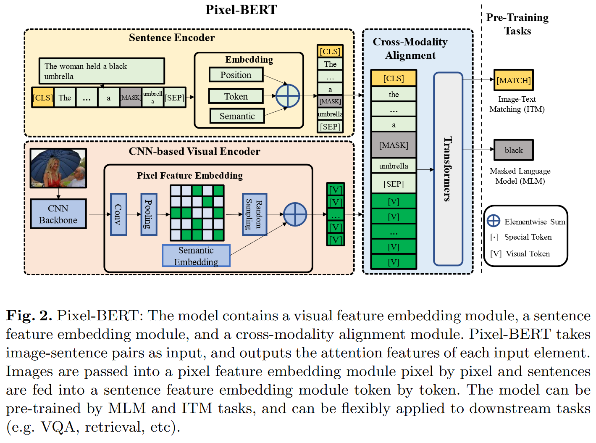

详细来说，当时主流的Region Feature Based方法提取视觉特是使用如Fast R-CNN的目标检测模型，通常在Visual Genome数据集上训练得到。这种目标检测模型，通常先提取可能存在物体的区域，然后根据区域特征进行物体类别的分类。相应的，这些区域的特征往往局限在固定的类目集合范围内，语义范围较为有限，这是也**使用区域语义特征的固有缺陷**。

Pixel-BERT的思路是**直接学习像素级别的表征来代替物体框为主的区域特征**，具体的，像素特征通过ResNet之类的卷积神经网络提取得到。对于给定的图片`I`，先使用CNN backbone提取特征（如从`224*224*3`经过多层卷积网络到`5*5*channel_dim`）。然后**按空间顺序，铺平网格特征序列**，计作 $v=\left\{ v_1, v_2, ..., v_k \right\} \in R^d$ ，`k`为像素的数量。最终的视觉语义embedding特征记作 $v=\left\{ \hat{v_1}, \hat{v_2}, ..., \hat{v_k} \right\} ，\hat{v_i} = v_i + s_v$ ，其中 $s_v$ 是可学习的语义表征向量，用于区分文本表征向量。由于所有的像素共用$s_v$，索引$s_v$也可以看作是CNN backbone的一个bias项。

此外，Pixel-BERT**使用随机像素采样机制来增强视觉表示的鲁棒性**，并使用MLM和ITM作为预训练任务进行预训练。最后通过对下游任务进行广泛的实验，在包括视觉问答（VQA）、图像文本检索和视觉推理等下游任务中取得了SOTA效果。

## 3.VIT：拥抱Transformer

Pixel-BERT之类的网络，减少了对与目标检测模型的依赖，仅使用深层卷积神经网络提取像素级别的特征作为下游多模态融合模块，极大简化了图文多模态表征模型的网络结构。那么，能不能进一步简化视觉表征模块，直接把图像特征简单加工后就直接输入到Transformer网络和文本特征一起做模态的融合？要做到这一点，需要先回答另一个问题，**Transformer网络能不能替换CNN作为视觉表征的Backnone？**虽然现在来看，答案是肯定的，但在开始阶段，这个过程并不是那么顺利。

**CNN应用于视觉表征有着很强的归纳偏置或者说先验**，在 CNN 中，局部性、二维邻域结构和平移不变性是在整个模型的每一层中都有体现，和视觉图像的特点极其类似：

-   **局部感知性**：卷积层通过卷积操作和参数共享，能够高效地提取输入图像的局部特征。这种局部感知性使得CNN能够捕捉图像中的局部结构，例如边缘、纹理等，从而更好地表征图像。
-   **层级结构**：CNN的层级结构包括卷积层、激活函数、池化层和全连接层。这种层级结构使得CNN能够逐层提取和组合特征，从低级到高级，形成更复杂的视觉表征。
-   **参数共享**：卷积层中的参数共享使得CNN的训练更加高效。相同的卷积核在不同位置对图像进行卷积操作，共享参数减少了模型的复杂度，同时也增强了模型的泛化能力。
-   **空间不变性**：卷积操作具有平移不变性，即无论图像中的物体在图像中的位置如何变化，卷积核都能检测到相应的特征，这对于图像分类、目标检测和图像分割等计算机视觉任务非常重要。

而在 Transformer 中的**Self-Attention层则是全局的，对于视觉输入的局部关系建模、图像的2D位置关系的建模，以及图像元素的平移不变性的把握上，都需要从头学习**。然而，即便是困难重重，因为有BERT的巨大成功，仍然有许多的研究者前赴后继投入到这个方向，并最终取得成功，其中Vision Transformer (ViT) 是最为经典的案例之一。

### 3.1 ViT范式视觉表征和预训练

#### （1）ViT：Transformer视觉表征

> AN IMAGE IS WORTH 16X16 WORDS: TRANSFORMERS FOR IMAGE RECOGNITION AT SCALE

**ViT将输入图片平铺成2D的Patch序列（16x16），并通过线性投影层将Patch转化成固定长度的特征向量序列，对应自然语言处理中的词向量输入**。同时，每个Patch可以有自己的位置序号，同样通过一个Embedding层对应到位置向量。最终Patch向量序列和视觉位置向量相加作为Transfomer Encoder的模型输入，这点与BERT模型类似。

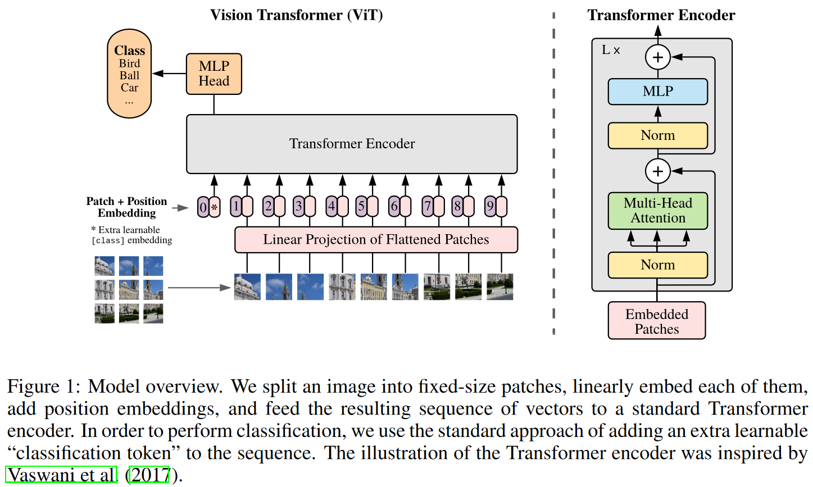

同样，ViT通过一个可训练的CLS token得到整个图片的表征，并接入全链接层服务于下游的分类任务。当经过大量的数据上预训练，迁移到多个中等或小规模的图像识别基准（ImageNet, CIFAR-100, VTAB 等）时，ViT取得了比CNN系的模型更好的结果，同时在训练时需要的计算资源大大减少。按说，ViT的思路并不复杂，甚至一般人也不难想到，但是为什么真正有效的工作确没有很快出现？

不卖关子，**ViT成功的秘诀在于大量的数据做预训练**，如果没有这个过程，在开源任务上直接训练，ViT网络仍会逊色于具有更强归纳偏置的CNN网络。

因此，**在此之后的一大研究方向就是如何更加有效的对ViT结构的网络进行预训练**。下面通过MAE和BEIT两个优秀的工作，来讨论这个方向上的两类主流方案。

#### （2）MAE：激进的Mask自监督预训练

> Masked Autoencoders Are Scalable Vision Learners

与自然语言理解类似，ViT模型能取得成功得益于预训练+微调的训练范式。前文提到，传统CNN视觉模型的预训练，仅仅是在大量的图像任务数据集上进行预先训练（如ImageNet分类任务等），然后使用训练后的权重进行初始化Backbone，在下游任务上继续微调完成相应任务。

早期的ViT的预训练和CNN预训练一样，都是通过大规模的有监督分类任务数据集进行训练，和BERT的自监督预训练仍有区别。而自监督预训练有着数据获取成本低、不需要标注、任务难度大模型学习充分等诸多好处，因此很多研究工作探索**自监督视觉预训练**，比较有代表性的实践工作如Masked AutoEncoder（MAE）。

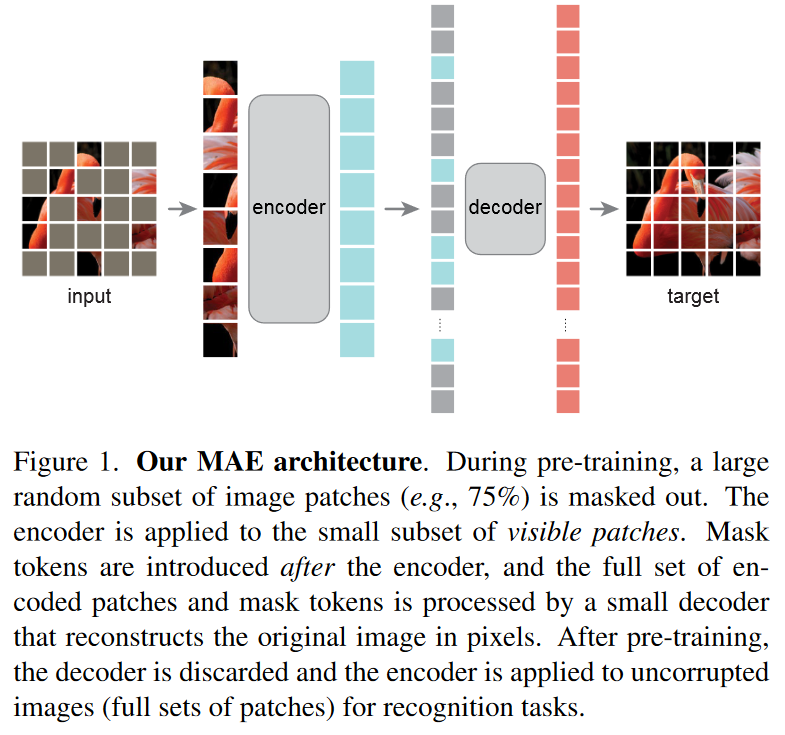

如图所示，MAE**以ViT为基础模型，先对完整图片进行Patch掩码，接着使用一个Transformer Encoder对未Mask的Patch进行编码，然后通过相对小的Transformer Decoder模型还原被Masked Patch，从而实现模型的自监督预训练**。

MAE取得成功的另一个核心原因是通过75%的高掩码率来对图像添加噪音，这样图像便很难通过周围的像素来对被掩码的像素进行重建，从而使编码器去学习图像中的语义信息。预训练之后，解码器被丢弃，编码器可以应用于未掩码的图像来进行识别任务。

相对于自然语言的自监督训练，MAE使用了更大的掩码比例。后人进一步分析，这么做动机是考虑自然语言和视觉特征的信息密度不同，简单来说：文本数据是经过人类高度抽象之后的一种信号，信息是密集的，可以仅仅预测文本中的少量被掩码掉的单词就能很好的捕捉文本的语义特征。而图像数据是一个信息密度非常小的矩阵，包含着大量的冗余信息，像素和它周围的像素存在较大的相似性，恢复被掩码的像素并不需要太多的语义信息。

### （3）BEIT：视觉“分词”表征预训练

> BEIT: BERT Pre-Training of Image Transformers

另一类Transformer视觉模型预训练的代表范式是BEIT（BERT Pre-Training of Image Transformers）模型。为了与BERT的预训练框架对齐，**BEIT通过辅助网络模块先对视觉Patch进行Tokenizer，得到整张图各部分的视觉Token ID。然后将视觉Patch视为自然语言中的单词进行掩码预测**，完成预训练流程。

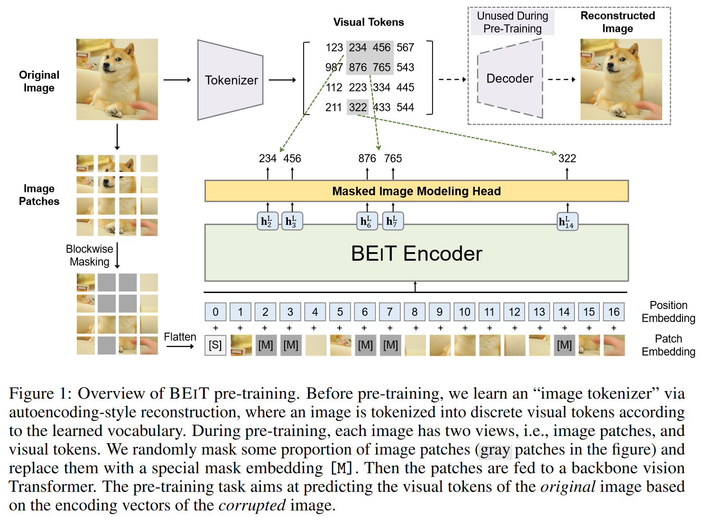

具体的如图所示，在预训练之前，BEIT先通过一个离散自回归编码器（ discrete Variational AutoEncoder，dVAE）学习了一个“图像分词”器，最终可以将图像编码成离散的视觉Token集合。而在预训练阶段，输入的图片存在两个视角，一是图像Patch，另一个是视觉Token。BEIT随机对Patch进行掩码，并将掩码部分替换为特殊的Mask Embedding（`[M]`，图中的灰色部分），随后将掩码后的Patch序列输入到ViT结构的模型中。预训练的目标则是基于被掩码的图像输入向量序列，预测源图像对应的视觉Token ID。

BEIT需要单独的dVAE网络辅助，相对MAE更为复杂，效果也相对不足，但为视觉预训练提供了一个不错的范式，同样是一次十分有价值的探索。

### 3.2 ViT为基础的多模态对齐与预训练

以ViT为基础的视觉预训练可以通过Transformers对视觉进行有效表征，这种方法也逐渐成为目前视觉信息编码的主流手段。以此为延伸，基于此的多模态预训练工作也层出不穷，也为如今的多模态大模型的顺理成章打下了坚实基础。

如下图，梳理了以ViT为延伸的多模态对齐和预训练工作，各工作之间都或多或少的有所关联，可谓是一脉相承。下面分别介绍这个技术方向的经典工作，读完本小结下面的内容再来看图中的模型关系，可能会更有感觉。

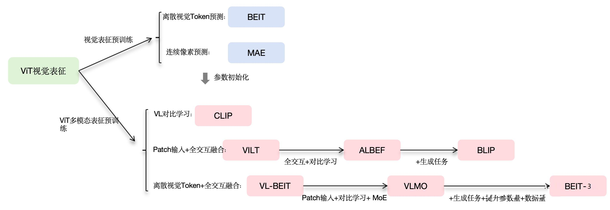

#### （1）CLIP

> Learning Transferable Visual Models From Natural Language Supervision

CLIP模型是OpenAI 2021发布的多模态对齐方法。与OpenAI的许多工作类似，**CLIP强调强大的通用性和Zero-Shot能力**，也因此至今仍有很强的生命力，相关技术被广泛应用。

CLIP的核心思路是通过对比学习的方法进行视觉和自然语言表征的对齐。如图中（1），CLIP首先分别对文本和图像进行特征抽取，文本的Encoder为预训练BERT，视觉侧的Encoder可以使用传统的CNN模型，也可是VIT系列模型。得到图文表征向量后，在对特征进行标准化（Normalize）后计算Batch内图文Pair对之间的余弦距离，通过Triple Loss或InfoNCELoss等目标函数拉近正样本对之间的距离，同时使负样本对的距离拉远。

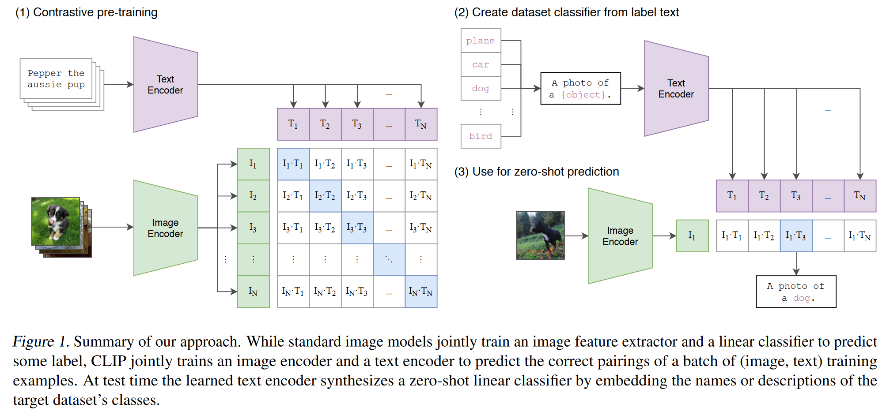

经过大量的图文Pair对进行预训练后，可以得到**在同一表征空间下的文本Encoder和图像Encoder**。

下游应用通常也是两种方式，一是**在下游任务上对模型进行微调**，适应定制的图文匹配任务，或者仅使用文本或图像Encoder做单模态任务；另一种使用方式是**直接使用预训练的图文表征Zero-Shot方式完成下游任务**。

CLIP进行Zero-Shot的一种使用方式如图中（2）和（3），对于一个图像分类任务，可以首先将所有的候选类别分别填充**`“A photo of a {object}”`**的模板，其中object为候选类别，对于一张待预测类别的图像，通过图像Encoder的到视觉表征后，与所有类别的模板文本Encoder表征进行相似度计算，最后选择相似度最高的类别即可作为预测结果。

CLIP凭借其简洁的架构和出众的效果，被后来很多工作引用，并使用CLIP预训练的Backbone作为视觉表征模块的初始化参数。

#### （2）ViLT

> ViLT: Vision-and-Language Transformer Without Convolution or Region Supervision

CLIP方法简单有效，双塔的网络结构对于下游应用也十分友好。但是如同表示型语义匹配类似，**双塔结构同样也有交互不足的问题，内积或余弦距离的模态融合方式匹配能力上限较低**，对于一些需要细粒度跨模态匹配的任务（VQA等）有时力不从心。因此，交互式的多模态对齐和融合仍然极具价值，典型的如ViLT模型。

ViLT是ViT在图文多模态方向上的工作延续。了解了基于Transformer的自然语言模型和视觉模型的预训练范式后，进阶到多模态融合十分容易理解。如图所示，与BERT文本对的输入方式类似，**ViLT将文本和视觉Patch的Embedding直接拼接作为Transformer编码器的输入，两种模态有各自可学习的位置编码和模态类型编码**。

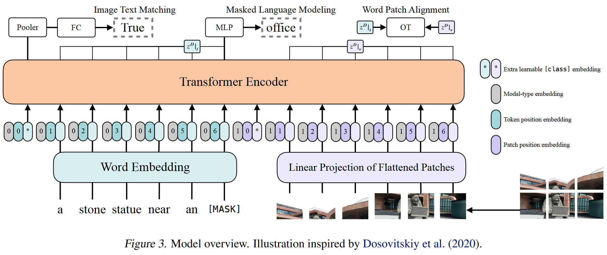

通过深层的Transformer编码，文本与视觉的模态得到了充分的融合。ViLT使用常用的ITM（Image Text Matching）和MLM（Masked Language Modeling)作为预训练目标。

-   **ITM（Image Text Matching）**：图文是否匹配的二分类目标，正**样本为常用数据集中提供的语义一致的图文Pair对，负样本对以0.5的概率随机地用替换正图文对中的图片为其他图片**；此外借鉴前人工作，匹配目标还增加了图文子区域的匹配目标Word Patch Alignment (WPA)，该目标并不常用，不作过多展开。
-   **MLM（Masked Language Modeling)**：以0.15的概率对文本的Token进行掩码，并通过图文的整体上下文信息对预测被掩码的Token。

如图下图，可以对比以CNN为基础的多模态预训练和以VIT为基础的预训练，在模型架构上的区别。

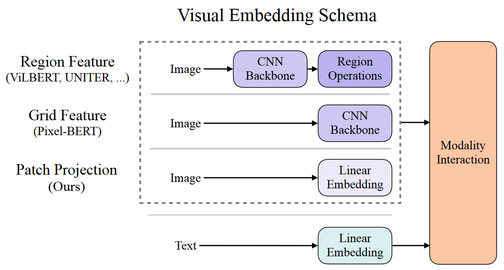

**而在ViLT之后，多模态预训练的一个较为明显的趋势，是****进一步提升模态对齐与融合的效果以及模型结构的通用性，使用统一模型视角进行跨模态对齐和融合**。在这个过程中，ALBEF（Align before Fuse）、BLIP（Bootstrapping Language-Image Pre-training）与BEIT-3系列等工作极具参考价值，下面简单对比其设计思路。

#### （3）ALBEF与BLIP

> Align before Fuse: Vision and Language Representation Learning with Momentum Distillation
> BLIP: Bootstrapping Language-Image Pre-training for Unified Vision-Language Understanding and Generation

ALBEF通过**多任务联合训练将类似CLIP的对比学习和类ViLT的交互融合范式统一到一个训练框架中**。如图所示，模型结构包括一个图像Encoder（12层）、一个文本Encoder（6层）和一个多模态融合的Encoder（6层），各Encoder均沿用Transformer网络。ALBEF的训练任务包括图文对比ITC（Image-Text Contrastive Learning）、ITM（Image-Text Matching）、MLM（Masked Language Modeling）。

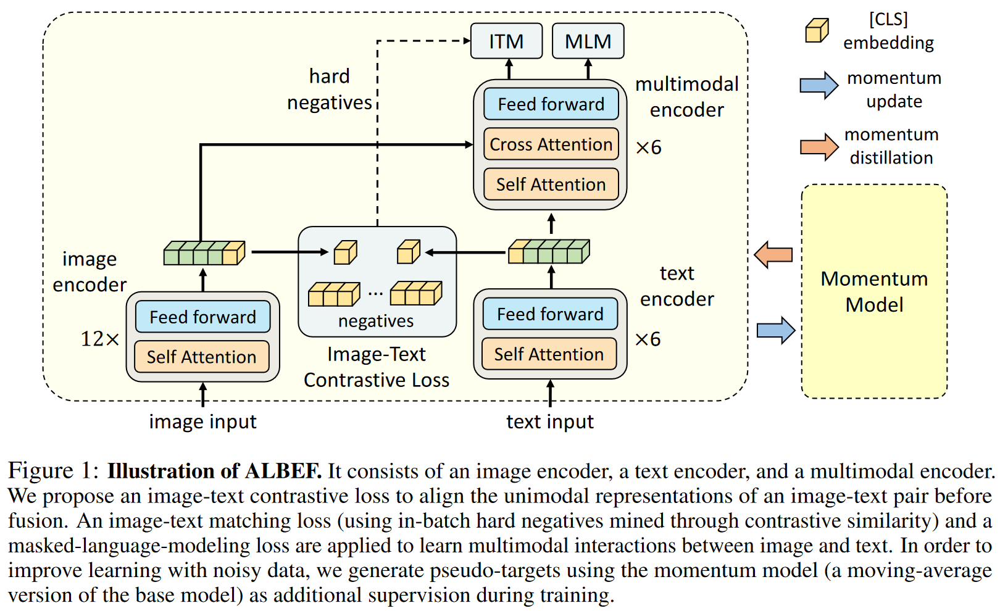

-   **ITC**：在图文模态深层融合之前，在对图文的表征序列Pooling后，通过对比学习Loss对图文单模态表征进行对齐。这部分和CLIP模型的训练设置类似，不同的是文本的Encoder相对视觉Encoder层数更浅。
-   **ITM**：图文Encoder输出的表征序列深层交互后，判断输入图文对是否匹配，与VILT一样是二分类任务。不同的是负样本对的构造，使用对比学习模块进行了Batch内的难负样本挖掘。主要思路是，对比学习模块中一个Batch中，模型认为最为相似的负样本对可以作为难负样本。
-   **MLM**：与VILT类似，随机对输入文本token进行掩码，通过图文上下文的输入信息预测被掩码的Token。

最后，由于ALBEF的预训练数据多数为互联网中挖掘的图文对，天然存在较大的噪声数据。为了缓解这个问题，ALBEF在训练过程中通过一个动量自蒸馏的模块（一个移动平均版本的ALBEF模型），生成训练数据集的伪标签，用来辅助模型的训练。

ALBEF通过多任务训练机制将模态对比匹配和深度模态融合结合在一起，下游任务可以根据具体需求使用不同的模块进行微调。与之遥相呼应的的是**BLIP**模型，**在ALBEF基础上，将MLM替换为LM（ Language Modeling）Loss，使得训练得到的模型同时可以支持图像描述文本的生成能力**，如图所示。使得多模态融合预训练有了多模态大模型即视感。

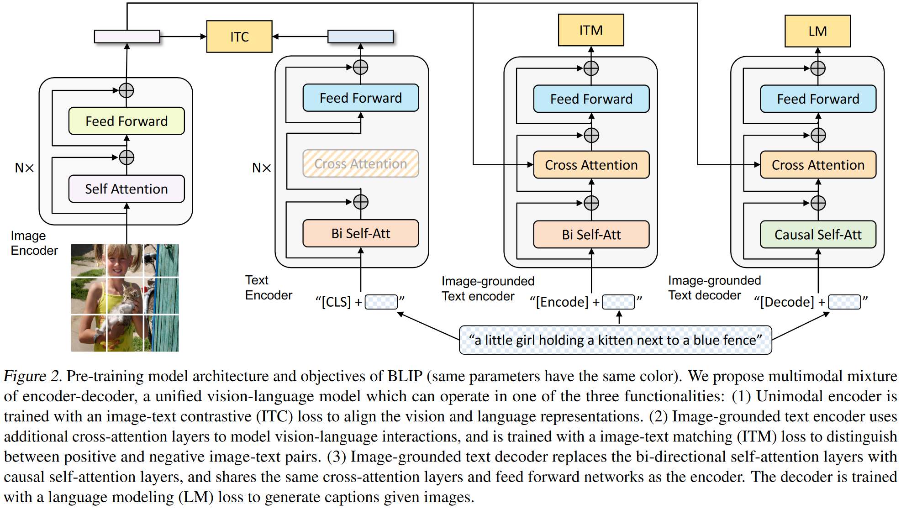

**经过大规模多模态数据的预训练，ALBEF和BLIP在下游任务微调中均取得了十分亮眼的效果**，在工业界也被广泛应用。

#### （4）VL-BEiT、VLMO与BEIT-3

> VL-BEIT: Generative Vision-Language Pretraining
> VLMO: Unified Vision-Language Pre-Training with Mixture-of-Modality-Experts
> Image as a Foreign Language: BEIT Pretraining for All Vision and Vision-Language Tasks

ALBEF和BLIP之类的工作虽然能够同时兼顾对比和深度融合两种训练模式，但**视觉和自然语言仍然需要单独的Encoder分别编码**，这显然还不是我们所期望的真正的多模态统一模型框架。可以从Microsoft Research的VL-BEIT、VLMO与BEIT-3这一系列工作一窥这个方向的探索过程。

VL-BEiT可以看作是前文提到的BEiT在多模态对齐预训练工作的延续，同时借鉴了ViLT的网络结构。如图所示，与ViLT的区别在于，**VL-BEIT期望将单模态和多模态统一到一个模型中**，在预训练任务设计上，同时考虑了纯文本、纯视觉以及图文多模态任务。纯文本任务为MLM（a）；纯视觉特征的MIM，其中MIM的目标是BEIT工作中的Visual Token ID（b）；图文多模态任务包括考虑文本特征的视觉Token预测，以及考虑视觉特征的文本Token预测（c）。

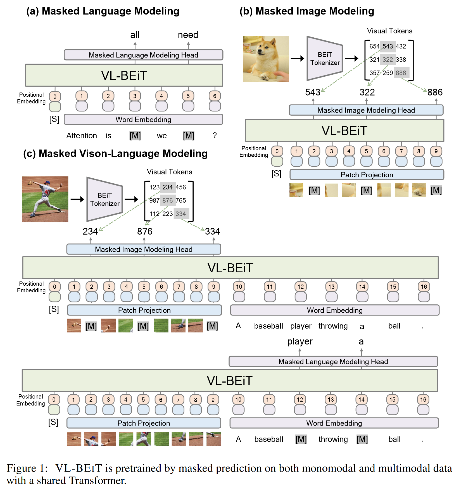

VLMO是VL-BEIT的同期工作，如图所示。VLMO相较于VL-BEIT的不同之处在于：

1.  舍弃了视觉侧的Visual Token ID预测，简化了整体的网络结构；
2.  增加了类似CLIP的图文对比学习任务，以及交互型的图文匹配任务；
3.  使用MoME Transformer结构，对不同的模态使用不同的Expert头。虽然VLMO相对于VL-BEIT在效果上并不出彩，但为后续BEIT-3的工作奠定了基础。

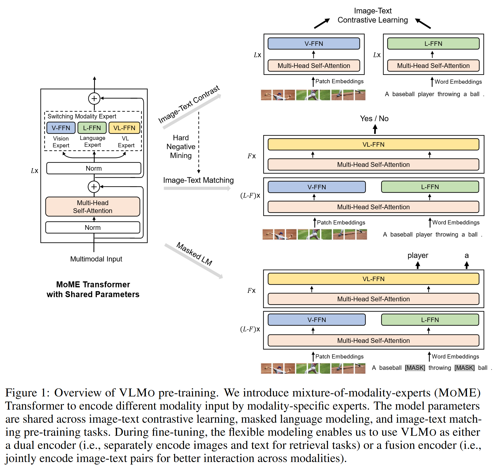

与VLMO网络结构类似，**BEIT-3将图像、文本和图文多模态输入统一到一个单独的Multiway Transformer网络**。不同于经典的Transformer，BEIT-3使用一个多类型输入共享的多头自注意力模块（Multi-Head Self-Attention），**不同类型的模态输入各有一个全连接专家模块单独学习**。如图所示，视觉模态使用V-FFN、文本模态对应L-FFN，图文多模态输入对应VL-FFN，模型会根据不同类型的模态输入选择不同的模块生效。

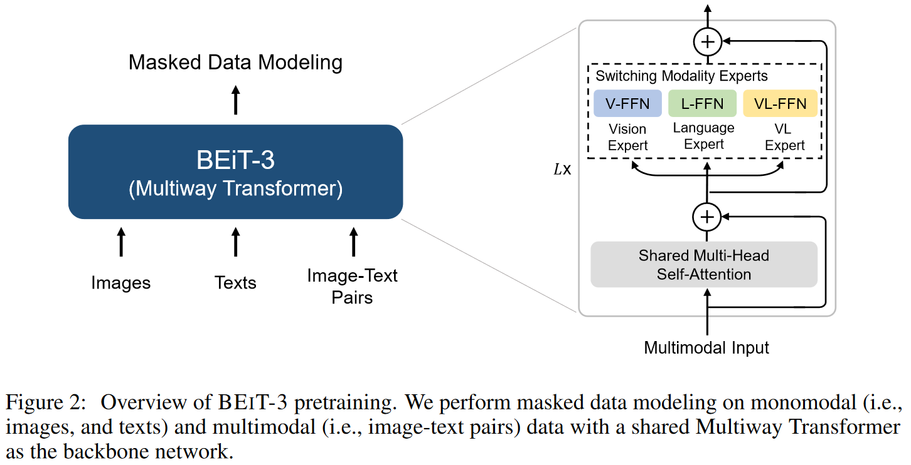

在预训练任务上，如图，BEIT-3相比之下也更加全面，不仅包括常用的图文对比学习、MLM和图像文本描述生成任务，还引进了文本和图像的单模态任务。这样的训练方式，使得BEIT-3真正统一了多模态的不同输入类型，同时更加全面和灵活的支持不同模态的下游任务。为了能够实现这样的能力，**BEIT-3使用了更多的预训练数据，模型容量相对于之前的工作也有了显著的提高（达到1.9B），相应地最终也取得了在当时更好的效果。**&#x20;

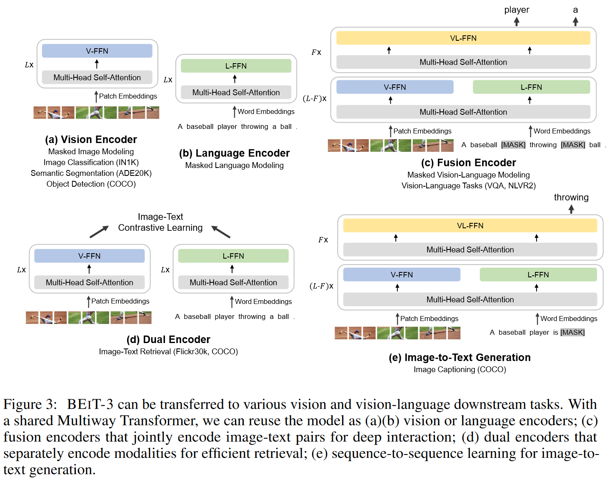

BEIT-3将多模态对齐和预训练的研究推到了一个新的高度，验证了**更多的数据+更大的模型取得更好的效果，在这个研究方向仍不失准**。虽然开始饱受争议，但随着ChatGPT的问世，这个发展思路的正确性被进一步加深，也催生了后面多模态大模型的一众研究工作。

## 4.多模态与大模型

下面通过各时期的优秀工作，来系统看一下类似GPT-4的多模态大模型的主流思路。

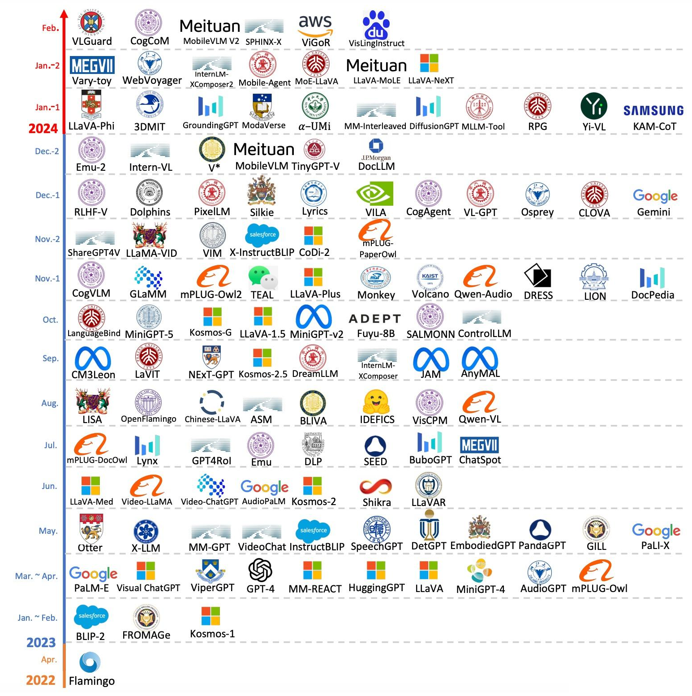

### 4.1 Flamingo

> Flamingo: a Visual Language Model for Few-Shot Learning

如今GPT-4代表着多模态大模型的顶尖水平，但在此之前，甚至在ChatGPT之前就已有相关探索工作，其中谷歌的Flamingo最具当前主流技术雏形。事实上，**Flamingo更像是图文多模态领域的GPT-3，不同的是它支持图文上下文的输入，通过In-Context Few-Shot方式完成任务**。Flamingo同样支持视频帧序列作为输入，通过Prompt指令完成Video理解任务。

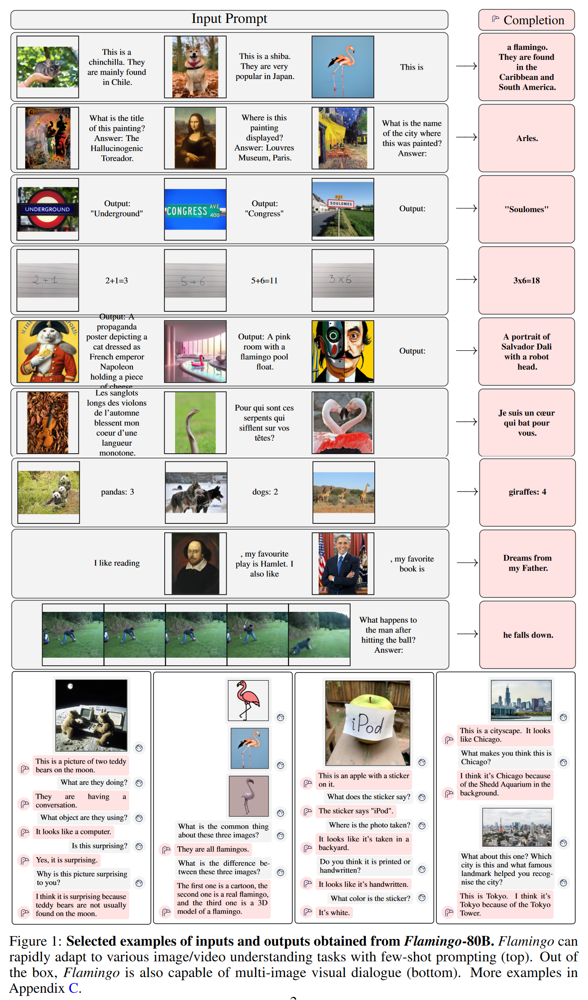

做到这种功能，在模型侧和GPT-3类似，不同的是Flamingo在**文本Transfomer网络中增加视觉输入特征**，模型结构如图所示，包括三个部分。

-   **视觉侧特征抽取使用预训练的ResNet和采样模块**（Perceiver Resampler，将变长的视觉特征输入转成少量的视觉特征）模型；
-   **文本侧模型使用LLM**（基座使用Chinchilla，同样是谷歌发布的对标GPT-3的大语言模型，并提供了1.4B、7B、和70B等版本，分别对应Flamingo-3B、Flamingo-9B和Flamingo-80B）；
-   GATED XATTN-DENSE层，用于连接LLM 层与视觉特征，允许 LM 在处理文本时考虑视觉信息。通过交叉注意力，LM 可以关注与视觉特征相关的部分。预训练LLM和视觉ResNet参数训练过程中是冻结状态。

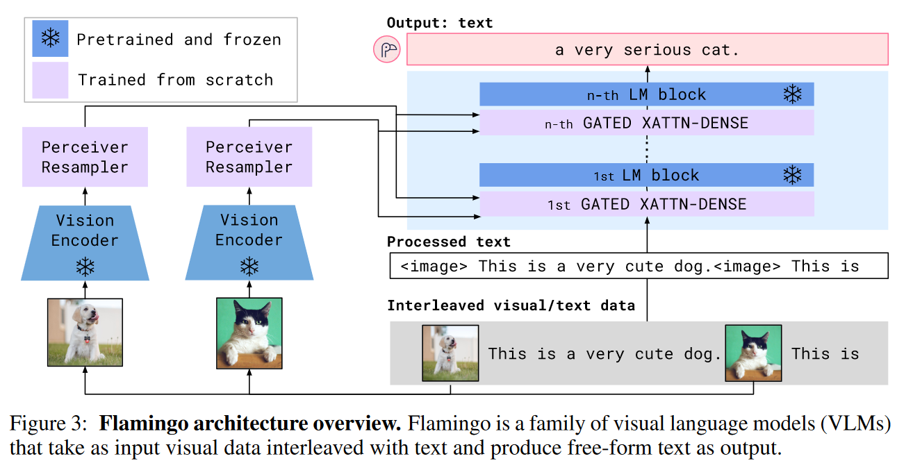

相应的，在数据层面Flamingo也是使用了多样形式的训练语聊，包括：

-   图文穿插形式：MultiModal MassiveWeb (M3W)，43 Million；
-   图文Pair对形式：LTIP(Long Text & Image Pairs)，312 Million；
-   带文本描述的短视频：VTP (Video & Text Pairs) ，27 Million 。

最后Flamingo在各种多模态任务上的效果也非常优秀，甚至在有些数据集上通过few-shot方式可以超过经典模型的SOTA。

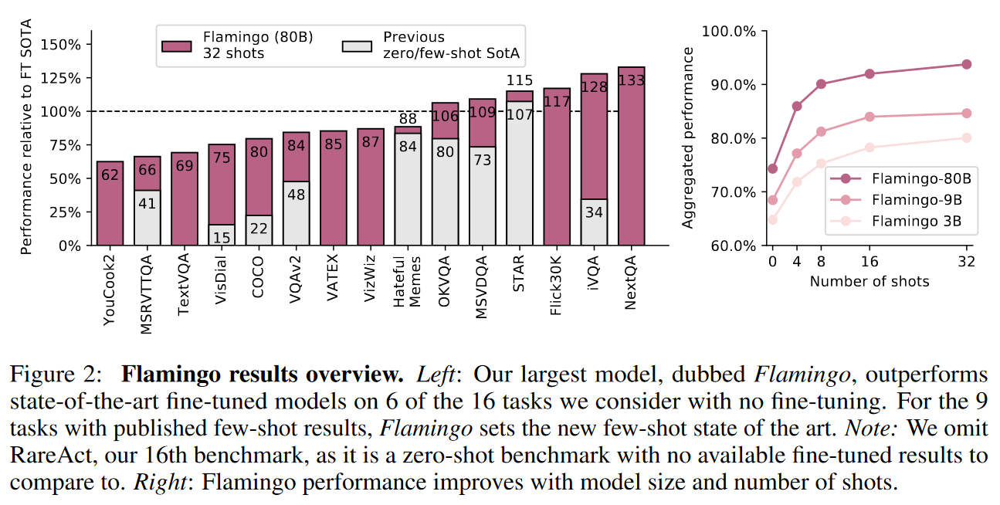

Flamingo凭借其出色的效果，吸引了许多研究者对于多模态大模型的注意，但当时这种规模的模型训练不是谁都能玩的起，因此并没有引起特别火热的跟风潮。直到ChatGPT的出现，让人逐渐接受了大模型这条道路的正确性，以前觉得自己玩不起的机构，砸锅卖铁拉投资也愿意投入，自此相关的开源研究开始如火如荼。

在众多开源工作中，BLIP-2以及与之一脉相承的InstructBLIP算是早期的探路者之一，可以从这两个工作开始讲起。

### 4.2 BLIP-2和InstructBLIP

> BLIP-2: Bootstrapping Language-Image Pre-training with Frozen Image Encoders and Large Language Models
>
>

BLIP-2的核心思路是**通过利用预训练好的视觉模型和语言模型来提升多模态效果和降低训练成本**。

BLIP-2的网络结构如图所示，从架构上来说，和Flamingo十分类似。包括**视觉编码层、视觉与文本的Adapter（Q-Former）以及大语言模型层**。

-   **视觉编码层**：使用ViT模型，权重初始化通过CLIP预训练完成，并剔除最后一次提升输出特征的丰富性；训练过程中冻结权重，不更新；
-   **文本侧的大语言模型层**：早期的BLIP-2使用OPT/FlanT5来实验Decoder based和Encoder-Decoder based LLM的效果；这部分同样在训练过程中冻结权重，不更新；
-   **图文Adapter层**：Q-Former结构，类似BLIP网络（同样先进行了图文多模态预训练模块），通过Queries向量，提取视觉侧的关键信息输入到LLM；这部分是多模态大模型训练过程中的主要参数。

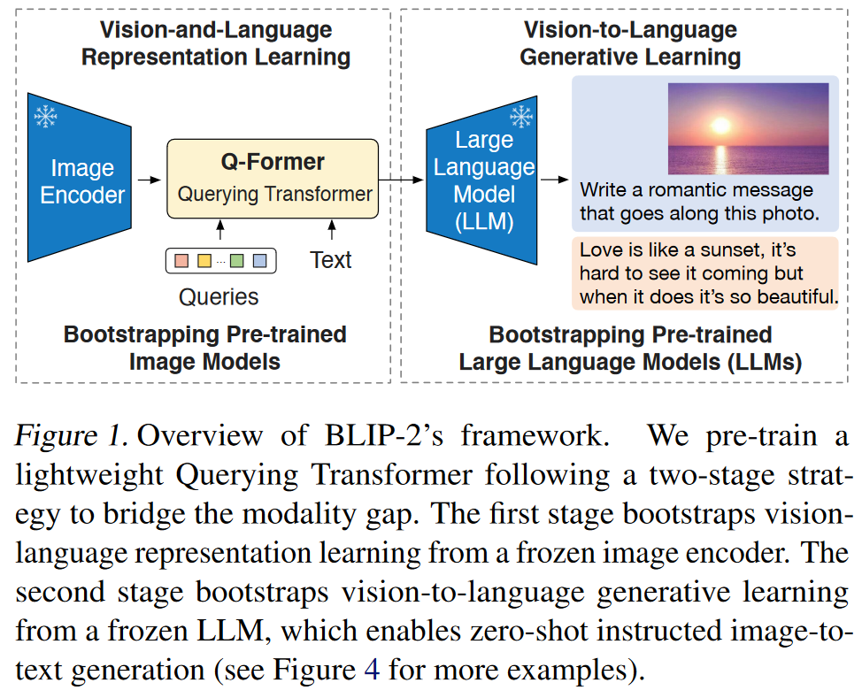

和Flamingo相比，**BLIP-2简化了视觉特征和大模型的交互，直接仅仅将视觉特征和文本特征一起作为大模型的输入**，没有深层的交互模块（如GATED XATTN-DENSE层）；另一方面在视觉和LLM的Adapter层做了更多的设计，即Q-Former结构，如图所示。从Q-Former结构图，可以看到BLIP的影子，最大的不同在于一个Learned Queries模块，用于对ViT输出的视觉特征进行采样（Pooling），得到固定长度的视觉特征序列。

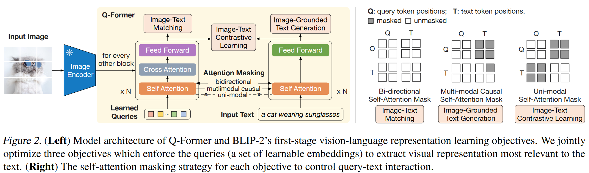

上面提到，为了避免灾难遗忘，BLIP-2**冻结了ViT和LLM的参数，只训练Q-Former模块**。为了训练更加稳定，Q-Former模块的训练包括两个阶段。

-   **Stage1**: 将Q-Former与冻结的ViT拼接，借鉴BLIP，使用 ITC（图文对比学习）、ITG（图生成文本）和ITM（图文匹配）任务进行学习，对参数进行初始化，学习图文相关性特征。
-   **Stage2**：如图所示，将Stage1得到的模型再拼接LLM，即Q-Former的输出可通过线性投影输入到LLM（冻结参数），进行视觉到自然语言的生成学习，目标是训练Q-Former使其输出的视觉特征和LLM的输入分布对齐。

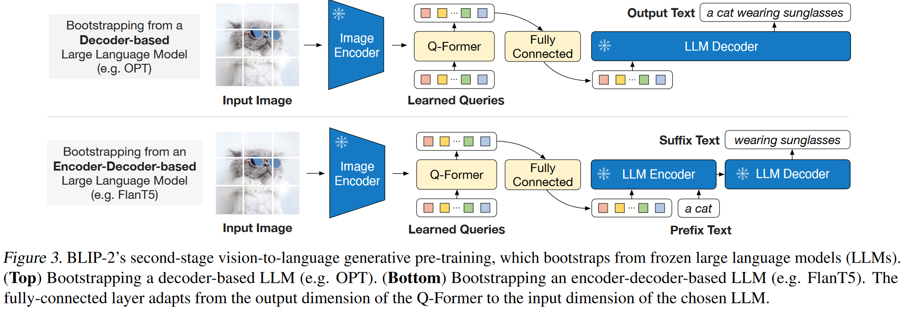

BLIP-2通过视觉和LLM的特征对齐，使得LLM具备了多模态理解能力，但其训练数据主要沿用BLIP（图文Pair对形式），和当下的多模态模型的主流技术方案仍存在一定GAP，是早期代表性探索之一。不过，随着指令微调成为大模型必备流程，后续BLIP-2也自然升级为InstructBLIP。

如下图，InstructBLIP的网络结构与BLIP-2几乎一致，同样也是2阶段训练，不同的是**采样了指令微调范式，将文本模态的Instruction也作为输入同时给到Q-former和LLM进行学习**。

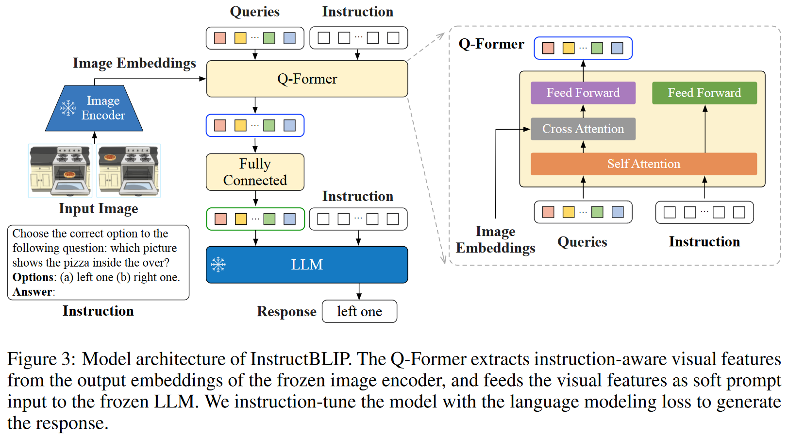

对应的，InstructBLIP的另一个不同是训练数据也使用指令形式，将各种类型任务的开源学术数据，使用模板构造成指令多模态数据。数据模板如图所示。

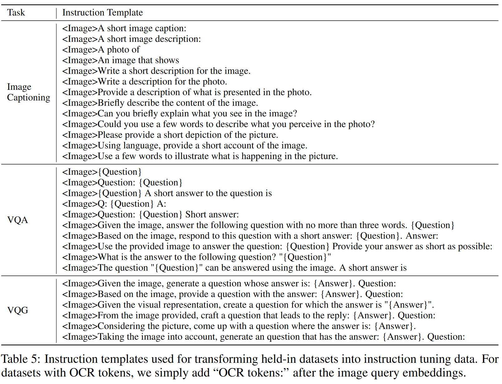

通过指令数据和指令微调，是的InstructBLIP可以像GPT-4一样通过指令提示词的方式完成任务，虽然效果上仍有差距。即使不是InstructBLIP的训练范式并不是开创性的，但是我们依然可以用InstructBLIP作为参考，来看对比后面要介绍的其他工作。

### 4.3 Qwen-VL

> Qwen-VL: A Versatile Vision-Language Model for Understanding, Localization, Text Reading, and Beyond

阿里巴巴的Qwen-VL是另一个比较经典的模型，十分值得作为案例介绍多模态大模型的训练要点。Qwen-VL**使用Qwen-7B LLM作为语言模型基座，Openclip预训练的ViT-bigG作为视觉特征Encoder，随机初始化的单层Cross-Attention模块作为视觉和自然语言的的Adapter**，总参数大小约9.6B。

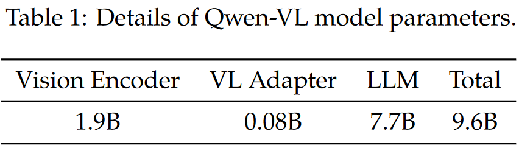

如下图，Qwen-VL的训练过程分为三个阶段：

-   **Stage1 为预训练**，目标是使用大量的图文Pair对数据对齐视觉模块和LLM的特征，这个阶段冻结LLM模块的参数；
-   **Stage2 为多任务预训练**，使用更高质量的图文多任务数据（主要来源自开源VL任务，部分自建数据集），更高的图片像素输入，全参数训练；
-   **Stage3 为指令微调阶段**，这个阶段冻结视觉Encoder模块，使用的数据主要来自大模型Self-Instruction方式自动生成，目标是提升模型的指令遵循和多轮对话能力。

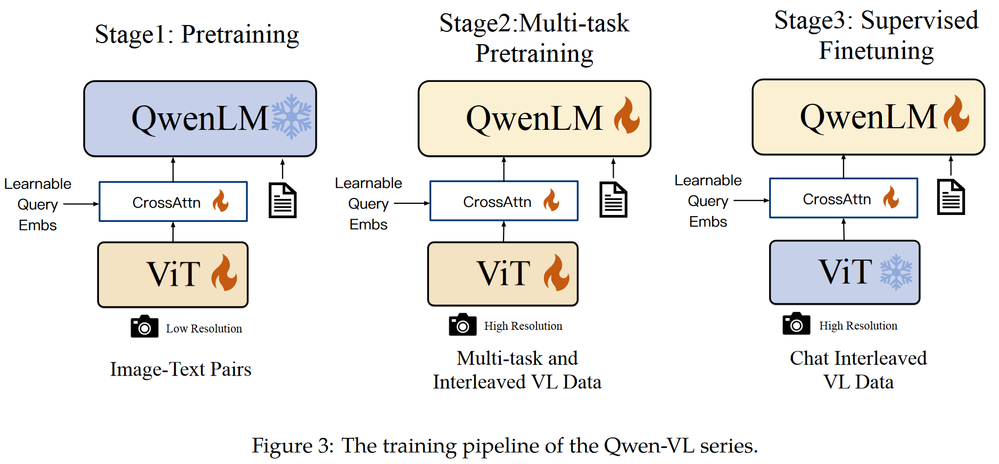

Qwen-VL的另一个启发是**在Stage2和Stage3的训练过程中，不止使用VL数据，还使用了纯文本的训练数据，避免遗忘LLM的能力**，这个策略的效果在其他的工作中也有所印证。此外，相比InstructBLIP，Qwen-VL模型视觉和LLM的Adapter模块简化很多，仅仅是一个浅层的Attention Pooling模块，通过更加细节的训练流程和更加丰富的训练数据，仍取得了比InstructBLIP更优的效果。

### 4.4 LLaVA1.5

> Improved Baselines with Visual Instruction Tuning

同样，微软的LLaVA也是一个持续更新的系列工作，这里主要总结LLaVA和LLaVA1.5的核心思路。下图为LLaVA1.5的数据和模型概况。可以看到，和Qwen-VL相比，**LLaVA1.5在预训练和指令微调数据上使用了更少的数据（将Qwen-VL的Stage2和Stage3都视作指令微调）**；**在模型结构上，除了视觉Encoder和LLM均使用了不同的基座模型，视觉和自然语言的Adapter使用更简单的MLP层**。

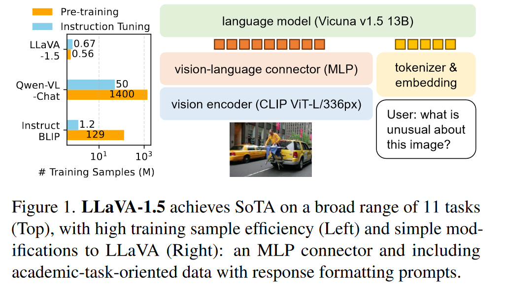

LLaVA1.5模型的效果在一些评测数据集上相比Qwen-VL有更好的效果，说明通过一些优化工作，使用更少的数据，更简单的Adapter结构，也能使LLM具备不错的多模态理解能力。在数据层面，如图所示，对比LLaVA1.5和LLaVA工作，通过增加高质量细粒度的VL数据、丰富指令、纯文本指令微调数据、提升图片输入像素、提升LLM参数规模等手段，可以有效提升模型效果。

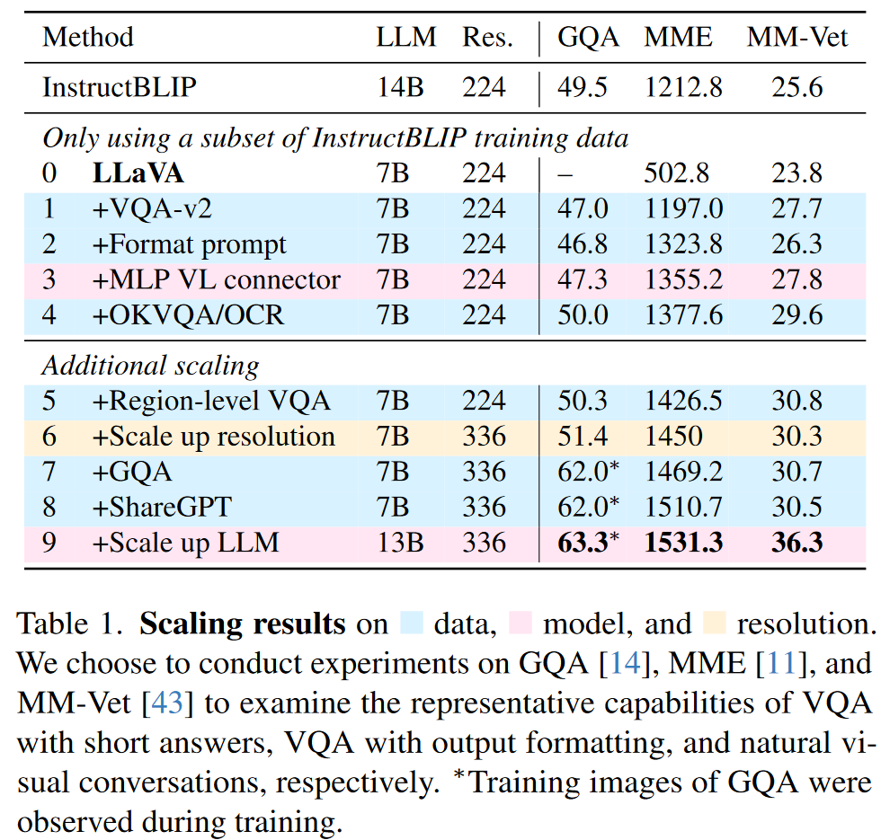

### 4.5 VILA

> VILA: On Pre-training for Visual Language Models

另一个与LLaVA比较类似，但有所补充的工作是英伟达的VILA（不是显卡）。**VILA模型的网络结构和LLaVA十分类似**，不做过多赘述。不同的是VILA通过实验，总结了多模态预训练的一些经验，其中有些经验在相关工作中也有所体现，主要为以下三点：

-   **LLM参与训练更好**：在预训练阶段冻结LLM参数，能做到不错的zero-shot的能力，但会损失in-context学习的能力，而LLM参数参与训练的话可以有效缓解；
-   **预训练数据使用图文交替数据更好**：图文Pair对并不是最优的选择，图文交错的数据效果更好；

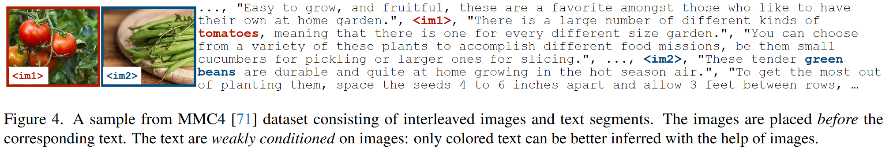

-   **SFT时纯文本数据图文数据混合更好**：在图文指令微调训练数据中混入纯文本的指令数据，不仅可以缓解纯文本能力的遗忘，还能提升VL任务的能力。

具体的，如下图，VILA的训练分为3个阶段，**视觉编码模块ViT参数均是冻结状态**。

-   Step 0 使用图文Pair数据对初始化Projector（图文Adapter）参数，LLM模块参数冻结；
-   Step 1使用图文交替数据全参数预训练；
-   Step 2使用指令微调数据进行全参数微调，其中微调数据混合了图文指令和纯文本指令；

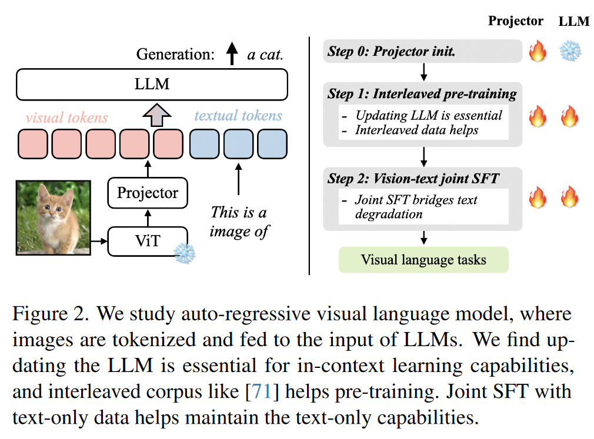

VILA是较新的工作，因此有更丰富的模型效果对比，如图38，相对各时期的SoTA，VILA在公开评测指标上有不错的效果。

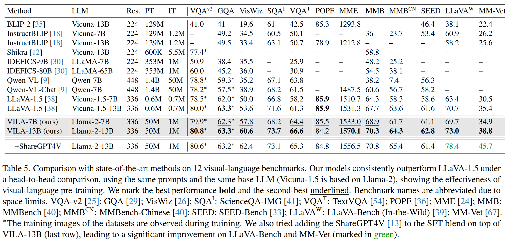

### 4.6 Gemini 1.0和Gemini 1.5

> Gemini: A Family of Highly Capable Multimodal Models

目光来到闭源世界，与VILA同阶段，谷歌公司发布了Gemini系列，又在近期发布了性能更强的Gemini 1.5，可惜被另一个热爱闭源的OpenAI的Sora抢了风头，属实悲催。由于Gemini系列并没有开源，只能通过技术报告中的简单介绍来了解其方法。

Gemini 1.0是一个多模态模型，这里模态除了图图像和文还包括音频、视频，符合谷歌多模态大模型一贯的ALL IN ONE的风格，这也是依赖积累丰富的数据资源和算力资源。Gemini 1.0提供Ultra、Pro和Nano版本，分别适应不同能力、参数大小和推理速度要求，最小的Nano甚至可以端上运行。

方法上，**Gemini 1.0的网络结构同样是Transformer Decoders，支持32K上下文长度，使用了Multi-Query Attention等优化机制**。如图所示，模型输入可以是文本、音频、视觉输入，输入视觉可以是图片、图表、截图、PDFs或视频等，输出可以是图片和文本（没错，可以生成图片）。视觉的Encoder模块借鉴了谷歌自己的Flamingo、CoCa和PaLI，结合这些模型，可以输入多模态的同时，也可以通过离散的视觉Tokens生成图片或视频等视觉模态。

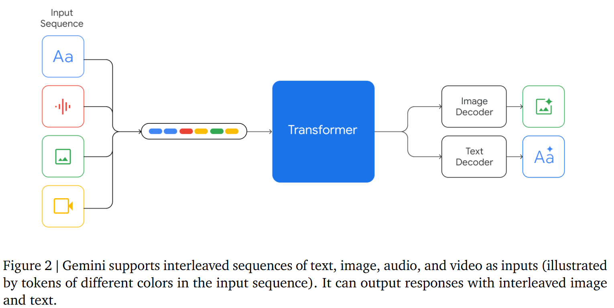

对于音频模态，Gemini可以直接输入Universal Speech Model (USM)的16kHz特征，具体可以参考USM工作。对于视频理解，Gemini通过将视频编码为长上下文窗口中的一系列帧来实现。视频帧或图像可以与文本或音频自然交织在一起，作为模型输入的一部分。Gemini同时支持不同像素输入的视觉以满足不同粒度的理解任务。

在具体训练数据方面，技术报告同样并没有提过多细节，只是简单说了数据包括什么模态、经过了什么清洗步骤等，也不再深究。至于最近的Gemini 1.5，同样是技术报告的形式发布，没有特别多技术细节，主要介绍了模型是如何的强。区别要点包括：模型在Gemini 1.0基础上引入了sparse mixture-of-expert (MoE)，同时强化了上下文长度（32K->10M）同时几乎没有损失上下文感知能力。在训练过程中，Gemini 1.5强化了指令微调过程，使用了用户偏好数据。

总体来说，虽然Gemini没有提供技术细节，但也体现了谷歌对于多模态大模型技术方向的判断，比如可以get到**网络结构的MoE、一个模型更多模态、超长上下文、文本生成+多模态生成结合**等。

### 4.7 LWM

> World Model on Million-Length Video And Language With RingAttention

最后，再介绍一篇和Gemini类似的开源工作《World Model on Million-Length Video And Language With RingAttention》，模型名LWM（Large World Model）。至于为什么叫World Model，意思可以通过视觉和视频的理解物理世界，，LWM是UC Berkeley最近发布的一篇工作，个人认为在开源方向上是一个优秀的工作，但好像也是由于Sora和Gemini 1.5的热度，没有引起太多关注。

LWM希望完成的任务和Gemini十分相似，**核心是超长上下文理解的多模态大模型**。凭借支持1M的token输入，LWM可以对超过一小时的视频进行理解，在Gemini 1.5之前几乎是多模态大模型中最长的上下文输入（之一）。LWM的主要工作要点包括：

-   支持超长上下文，可处理超长的文本、图片序列或视频等；
-   一些技术难点方案：Masked Sequence Packing方法混合的输入长度；通过loss weighting 平衡视觉和文本模态；模型自动生成长序列问答数据集用于模型训练；
-   实现了高性能的RingAttention，Masked Sequence Packing等优化项，完成了百万级别长度的多模态序列的训练；
-   开源7B参数规模的大模型，包括长上下文的文本模态模型（LWM-Text，LWM-Text-Chat），和多模态模型（LWM，LWM-Chat）。

具体方案上，LWM使用Transformer架构，在LLama2 7B基础上扩充上下文理解的长度上限，模型结构如图所示：

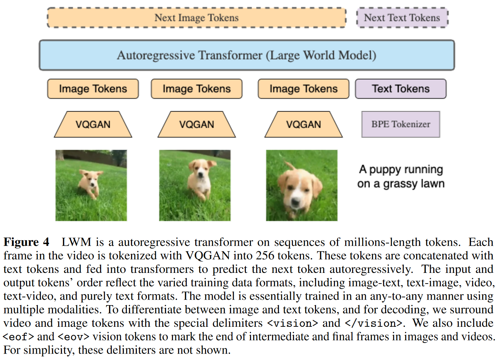

与之前大多数方法不同的是，视觉的编码器使用VQGAN，可以将256 × 256输入图片编码成16 × 16 离散Token。这使得LWM不仅可以生成文本，也可以基于文本生成Image Token还原成视频。对于多图或视频帧，可以分别做视觉特征抽取，和文本模态一起输入到LLM中。

在模型训练流程上，主要分为两个阶段的训练：

-   **阶段一**，使用Books数据集，先扩充文本LLM上下文长度到1M；
-   **阶段二**，长上下文的多模态训练，即混合图-文数据、视频-文本数据、以及纯文本的Books数据进行训练。

上面两个过程有两个核心问题需要解决：

1.  长文档的可扩展训练；
2.  如何稳定地扩展LLM的上下文。

前者关注训练的效率和开销，后者则关注长上下文拓展的有效性。针对问题1，**LWM主要实现了高效的RingAttention，同时结合了FlashAttention**；针对问题2，一方面，**两个训练阶段都是多轮训练方式，逐步提升上下文长度的方式**，如下图。另一方面通过简单的调整了RoPE的 $\theta$ 参数，提升模型长文本的位置编码能力。

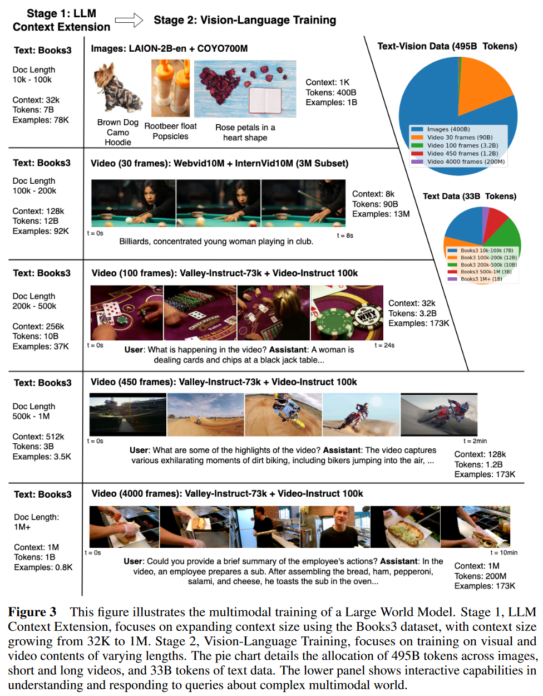

总的来说，LWM是一篇不错的文章，最重要的是开源，技术方案基本没有保留，值得拉出来单独讨论。在效果上LWM和Gemini 1.0 Pro以及GPT4有一定的竞争力，更多的细节可以阅读原论文。

## 5.总结

写到这里，吐一口老血，但还是要总结一下。本文梳理了2019年至2024年视觉表征和多模态表征的一些变化，主要涉及视觉表征和视觉预训练、多模态表征对齐（或融合）和多模态预训练、多模态大模型技术的相关工作。各工作之间的简化关系如下图，脉络主要是结合笔者自己各阶段的实践经历和认识，会出现一些地方不严谨的地方，欢迎指正。

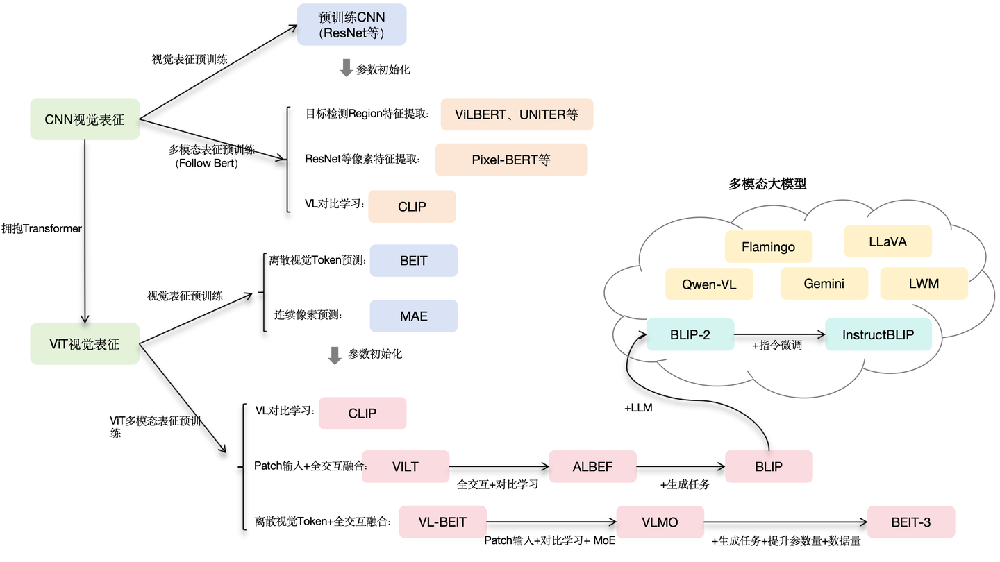

关于未来畅想，从最近的工作上来看，多模态的呈现出以大模型为主线，逐步开始朝长上下文、混合模态、世界模型、多模态生成等方向发展。开始在自己工作的实践中得到的一个个人观点，是多模态大模型的惊艳能力主要来自于文本大模型中所蕴含的知识，以及超强的上下文理解能力，视觉特征只是从属的信息输入或感知源。但近期Gemini 1.5、LWM、甚至Sora等工作又开始尝试大模型理解物理世界（引出世界模型的概念），大模型好像开始从文本之外的模态强化输入信息的影响力。不管怎么说，持续的更新迭代让人耳目一新，相信也会不断刷新人们对人工智能边界的认知。

## 6.论文打包下载

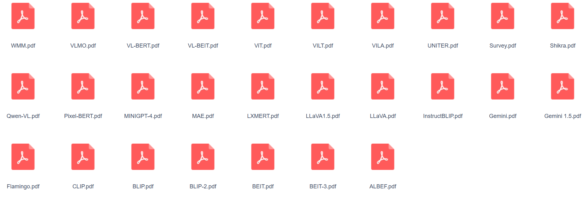

PS：引用文章可以细读，论文打包下载链接: [https://pan.baidu.com/s/18tkHDkDmGKvzEeGSEc52Jg](https://link.zhihu.com/?target=https%3A//pan.baidu.com/s/18tkHDkDmGKvzEeGSEc52Jg "https://pan.baidu.com/s/18tkHDkDmGKvzEeGSEc52Jg") 提取码: hvkf
